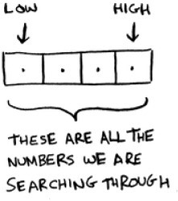
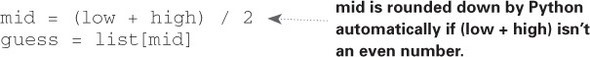
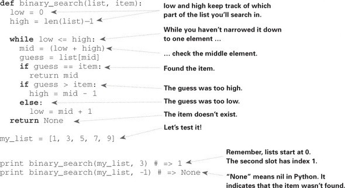
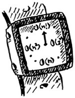
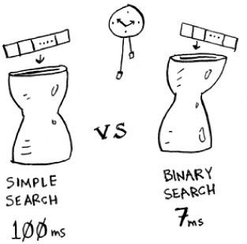
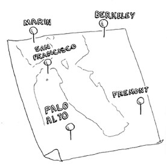
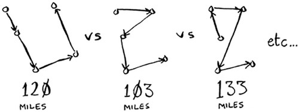
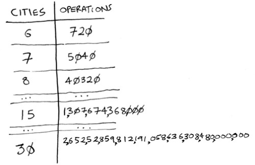

# introduction to algorithms

## In this chapter

- You get a foundation for the rest of the book.

- You write your first search algorithm (binary search)

- You learn how to talk about the running time of an algorithm (Big O notation).

- You're introduced to a common technique for designing algorithms (recursion).

## Introduction

An algorithm is a set of instructions for accomplishing a task. Every piece of code could be called an algorithm, but this book covers the more interesting bits. I chose the algorithms in this book for inclusion because they're fast, or they solve interesting problems, or both. Here are some highlights:

- Chapter 1 talks about binary search and shows how an algorithm can speed up your code. In one example, the number of steps needed goes from 4 billion down to 32

- A GPS device uses graph algorithms (as you'll learn in chapters 6, 7, and 8) to calculate the shortest route to your destination. 

- You can use dynamic programming (discussed in chapter 9) to write an Al algorithm that plays checkers

In each case, I'll describe the algorithm and give you an example. Then I'll talk about the running time of the algorithm in Big O notation Finally, I'll explore what other types of problems could be solved by the same algorithm 

## What you'll learn about performance

The good news is, an implementation of every algorithm in this book is probably available in your favorite language, so you don't have to write each algorithm yourself! But those implementations are useless if you don't understand the trade-offs. In this book, you'll learn to compare trade-offs between different algorithms: Should you use merge sort or quicksort? Should you use an array or a list? Just using a different data structure can make a big difference.

## What you'll learn about solving problems

You'll learn techniques for solving problems that might have been out of your grasp until now. For example:

- If you like making video games, you can write an Al system thatfollows the user around using graph algorithms. 

- You'll learn to make a recommendations system using k-nearest neighbors

- Some problems aren't solvable in a timely manner! The part of this book that talks about NP-complete problems shows you how to identify those problems and come up with an algorithm that gives you an approximate answer

More generally, by the end of this book, you'll know some of the most widely applicable algorithms. You can then use your new knowledge to learn about more specific algorithms for AL databases, and so on. Or you can take on bigger challenges at work.

> You’ll need to know basic algebra before starting this book. In particular, take this function: f(x) = x × 2. What is f(5)? If you answered 10, you’re set. 
>Additionally, this chapter (and this book) will be easier to follow if you’re familiar with one programming language. All the examples in this book are in Python. If you don’t know any programming languages and want to learn one, choose Python—it’s great for beginners. If you know another language, like Ruby, you’ll be fine.

## BINARY SEARCH 


Suppose you’re searching for a person in the phone book (what an old-fashioned sentence!). Their name starts with K. You could start at the beginning and keep flipping pages until you get to the Ks. But you’re more likely to start at a page in the middle, because you know the Ks are going to be near the middle of the phone book. 

Or suppose you’re searching for a word in a dictionary, and it starts with O. Again, you’ll start near the middle. 

Now suppose you log on to Facebook. When you do, Facebook has to verify that you have an account on the site. So, it needs to search for your username in its database. Suppose your username is karlmageddon. Facebook could start from the As and search for your name—but it makes more sense for it to begin somewhere in the middle. 

This is a search problem. And all these cases use the same algorithm to solve the problem: binary search.


Binary search is an algorithm; its input is a sorted list of elements (I’ll explain later why it needs to be sorted). If an element you’re looking for is in that list, binary search returns the position where it’s located. Otherwise, binary search returns null. 

For example:


Looking for companies in a phone book with binary search

Here’s an example of how binary search works. I’m thinking of a number between 1 and 100.


You have to try to guess my number in the fewest tries possible. With every guess, I’ll tell you if your guess is too low, too high, or correct. 
Suppose you start guessing like this: 1, 2, 3, 4 .... Here’s how it would go.


**A bad approach to number guessing**

This is simple search (maybe stupid search would be a better term). With each guess, you’re eliminating only one number. If my number was 99, it could take you 99 guesses to get there! 


### A better way to search 

Here’s a better technique. Start with 50.


Too low, but you just eliminated half the numbers! Now you know that 1–50 are all too low. Next guess: 75. 


Too high, but again you cut down half the remaining numbers! With binary search, you guess the middle number and eliminate half the remaining numbers every time. Next is 63 (halfway between 50 and 75). 


This is binary search. You just learned your first algorithm! Here’s how many numbers you can eliminate every time.


Eliminate half the numbers every time with binary search.

Whatever number I’m thinking of, you can guess in a maximum of seven guesses—because you eliminate so many numbers with every guess! 
Suppose you’re looking for a word in the dictionary. The dictionary has 240,000 words. In the worst case, how many steps do you think each search will take? 


Simple search could take 240,000 steps if the word you’re looking for is the very last one in the book. With each step of binary search, you cut the number of words in half until you’re left with only one word. 


So binary search will take 18 steps—a big difference! In general, for any list of n, binary search will take log2 n steps to run in the worst case, whereas simple search will take n steps. 

>## Logarithms
>You may not remember what logarithms are, but you probably know what exponentials are. log10 100 is like asking, “How many 10s do we multiply together to get 100?” The answer is 2: 10 × 10. So log10 100 = 2. Logs are the flip of exponentials. </br>
> 
>**Logs are the flip of exponentials.**</br>
>In this book, when I talk about running time in Big O notation (explained a little later), log always means log2. When you search for an element using simple search, in the worst case you might have to look at every single element. So for a list of 8 numbers, you’d have to check 8 numbers at most. For binary search, you have to check log n elements in the worst case. For a list of 8 elements, log 8 == 3, because 23 == 8. So for a list of 8 numbers, you would have to check 3 numbers at most. For a list of 1,024 elements, log 1,024 = 10, because 210 == 1,024. So for a list of 1,024 numbers, you’d have to check 10 numbers at most.</br>

>#### Note 
>I’ll talk about log time a lot in this book, so you should understand the concept of logarithms. If you don’t, Khan Academy (khanacademy.org) has a nice video that makes it clear. 

>#### Note
>Binary search only works when your list is in sorted order. For example, the names in a phone book are sorted in alphabetical order, so you can use binary search to look for a name. What would happen if the names weren’t sorted? 

Let’s see how to write binary search in Python. The code sample here uses arrays. If you don’t know how arrays work, don’t worry; they’re covered in the next chapter. You just need to know that you can store a sequence of elements in a row of consecutive buckets called an array. The buckets are numbered starting with 0: the first bucket is at position #0, the second is #1, the third is #2, and so on. 

The `binary_search` function takes a sorted array and an item. If the item is in the array, the function returns its position. You’ll keep track of what part of the array you have to search through. At the beginning, this is the entire array: 

```python
low = 0
high = len(list) - 1
```



Each time, you check the middle element:



If the guess is too low, you update low accordingly: 

```python
if
    guess < item:
    low = mid + 1
```


And if the guess is too high, you update high. Here’s the full code: 



## EXERCISES 

### 1.1 
Suppose you have a sorted list of 128 names, and you’re searching through it using binary search. What’s the maximum number of steps it would take? 


### 1.2 
Suppose you double the size of the list. What’s the maximum number of steps now?


## Running time 



Any time I talk about an algorithm, I’ll discuss its running time. Generally you want to choose the most efficient algorithm—whether you’re trying to optimize for time or space. 

Back to binary search. How much time do you save by using it? Well, the first approach was to check each number, one by one. If this is a list of 100 numbers, it takes up to 100 guesses. If it’s a list of 4 billion numbers, it takes up to 4 billion guesses. So the maximum number of guesses is the same as the size of the list. This is called linear time. 
Binary search is different. If the list is 100 items long, it takes at most 7 guesses. If the list is 4 billion items, it takes at most 32 guesses. Powerful, eh? Binary search runs in logarithmic time (or log time, as the natives call it). Here’s a table summarizing our findings today. 


## BIG O NOTATION 
Big O notation is special notation that tells you how fast an algorithm is. Who cares? Well, it turns out that you’ll use other people’s algorithms often—and when you do, it’s nice to understand how fast or slow they are. In this section, I’ll explain what Big O notation is and give you a list of the most common running times for algorithms using it. 

### Algorithm running times grow at different rates 


Bob is writing a search algorithm for NASA. His algorithm will kick in when a rocket is about to land on the Moon, and it will help calculate where to land. 

This is an example of how the run time of two algorithms can grow at different rates. Bob is trying to decide between simple search and binary search. The algorithm needs to be both fast and correct. On one hand, binary search is faster. And Bob has only 10 seconds to figure out where to land—otherwise, the rocket will be off course. On the other hand, simple search is easier to write, and there is less chance of bugs being introduced. And Bob really doesn’t want bugs in the code to land a rocket! To be extra careful, Bob decides to time both algorithms with a list of 100 elements. 

Let’s assume it takes 1 millisecond to check one element. With simple search, Bob has to check 100 elements, so the search takes 100 ms to run. On the other hand, he only has to check 7 elements with binary search (log2 100 is roughly 7), so that search takes 7 ms to run. But realistically, the list will have more like a billion elements. If it does, how long will simple search take? How long will binary search take? Make sure you have an answer for each question before reading on. 




**Running time for simple search vs. binary search, with a list of 100 elements**

Bob runs binary search with 1 billion elements, and it takes 30 ms (log2 1,000,000,000 is roughly 30). “32 ms!” he thinks. “Binary search is about 15 times faster than simple search, because simple search took 100 ms with 100 elements, and binary search took 7 ms. So simple search will take 30 × 15 = 450 ms, right? Way under my threshold of 10 seconds.” Bob decides to go with simple search. Is that the right choice? 

No. Turns out, Bob is wrong. Dead wrong. The run time for simple search with 1 billion items will be 1 billion ms, which is 11 days! The problem is, the run times for binary search and simple search don’t grow at the same rate. 


That is, as the number of items increases, binary search takes a little more time to run. But simple search takes a lot more time to run. So as the list of numbers gets bigger, binary search suddenly becomes a lot faster than simple search. Bob thought binary search was 15 times faster than simple search, but that’s not correct. If the list has 1 billion items, it’s more like 33 million times faster. That’s why it’s not enough to know how long an algorithm takes to run—you need to know how the running time increases as the list size increases. That’s where Big O notation comes in. 

Big O notation tells you how fast an algorithm is. For example, suppose you have a list of size n. Simple search needs to check each element, so it will take n operations. The run time in Big O notation is O(n). Where are the seconds? There are none—Big O doesn’t tell you the speed in seconds. Big O notation lets you compare the number of operations. It tells you how fast the algorithm grows. 


Here’s another example. Binary search needs log n operations to check a list of size n. What’s the running time in Big O notation? It’s O(log n). In general, Big O notation is written as follows. 


**What Big O notation looks like**


This tells you the number of operations an algorithm will make. It’s called Big O notation because you put a “big O” in front of the number of operations (it sounds like a joke, but it’s true!). 

Now let’s look at some examples. See if you can figure out the run time for these algorithms.

#### Visualizing different Big O run times

Here’s a practical example you can follow at home with a few pieces of paper and a pencil. Suppose you have to draw a grid of 16 boxes. 


**What’s a good algorithm to draw this grid?**

#### Algorithm 1

One way to do it is to draw 16 boxes, one at a time. Remember, Big O notation counts the number of operations. In this example, drawing one box is one operation. You have to draw 16 boxes. How many operations will it take, drawing one box at a time? 


Drawing a grid one box at a time

It takes 16 steps to draw 16 boxes. What’s the running time for this algorithm?

#### Algorithm 2 

Try this algorithm instead. Fold the paper.


In this example, folding the paper once is an operation. You just made two boxes with that operation!

Fold the paper again, and again, and again.


Unfold it after four folds, and you’ll have a beautiful grid! Every fold doubles the number of boxes. You made 16 boxes with 4 operations! 


**Drawing a grid in four folds**

You can “draw” twice as many boxes with every fold, so you can draw 16 boxes in 4 steps. What’s the running time for this algorithm? Come up with running times for both algorithms before moving on. 
Answers: Algorithm 1 takes O(n) time, and algorithm 2 takes O(log n) time. 

### Big O establishes a worst-case run time 

Suppose you’re using simple search to look for a person in the phone book. You know that simple search takes O(n) time to run, which means in the worst case, you’ll have to look through every single entry in your phone book. In this case, you’re looking for Adit. This guy is the first entry in your phone book. So you didn’t have to look at every entry—you found it on the first try. Did this algorithm take O(n) time? Or did it take O(1) time because you found the person on the first try? 

Simple search still takes O(n) time. In this case, you found what you were looking for instantly. That’s the best-case scenario. But Big O notation is about the worst-case scenario. So you can say that, in the worst case, you’ll have to look at every entry in the phone book once. That’s O(n) time. It’s a reassurance—you know that simple search will never be slower than O(n) time. 

>Note
>Along with the worst-case run time, it’s also important to look at the average-case run time. Worst case versus average case is discussed in chapter 4. 

### Some common Big O run times 

Here are five Big O run times that you’ll encounter a lot, sorted from fastest to slowest:

- O(log n), also known as log time. Example: Binary search. 
- O(n), also known as linear time. Example: Simple search. 
- O(n * log n). Example: A fast sorting algorithm, like quicksort (coming up in chapter 4). 
- O(n2). Example: A slow sorting algorithm, like selection sort (coming up in chapter 2). 
- O(n!). Example: A really slow algorithm, like the traveling salesperson (coming up next!). 

Suppose you’re drawing a grid of 16 boxes again, and you can choose from 5 different algorithms to do so. If you use the first algorithm, it will take you O(log n) time to draw the grid. You can do 10 operations per second. With O(log n) time, it will take you 4 operations to draw a grid of 16 boxes (log 16 is 4). So it will take you 0.4 seconds to draw the grid. What if you have to draw 1,024 boxes? It will take you log 1,024 = 10 operations, or 1 second to draw a grid of 1,024 boxes. These numbers are using the first algorithm. 

The second algorithm is slower: it takes O(n) time. It will take 16 operations to draw 16 boxes, and it will take 1,024 operations to draw 1,024 boxes. How much time is that in seconds? 

Here’s how long it would take to draw a grid for the rest of the algorithms, from fastest to slowest:


**There are other run times, too, but these are the five most common.**

This is a simplification. In reality you can’t convert from a Big O run time to a number of operations this neatly, but this is good enough for now. We’ll come back to Big O notation in chapter 4, after you’ve learned a few more algorithms. For now, the main takeaways are as follows: 

-Algorithm speed isn’t measured in seconds, but in growth of the number of operations. 
-Instead, we talk about how quickly the run time of an algorithm increases as the size of the input increases. 
-Run time of algorithms is expressed in Big O notation. 
-O(log n) is faster than O(n), but it gets a lot faster as the list of items you’re searching grows


## EXERCISES 
Give the run time for each of these scenarios in terms of Big O. 


1.3 
You have a name, and you want to find the person’s phone number in the phone book.


1.4 
You have a phone number, and you want to find the person’s name in the phone book. (Hint: You’ll have to search through the whole book!) 


1.5 
You want to read the numbers of every person in the phone book.


1.6 
You want to read the numbers of just the As. (This is a tricky one! It involves concepts that are covered more in chapter 4. Read the answer—you may be surprised!) 

### The traveling salesperson 


You might have read that last section and thought, “There’s no way I’ll ever run into an algorithm that takes O(n!) time.” Well, let me try to prove you wrong! Here’s an example of an algorithm with a really bad running time. This is a famous problem in computer science, because its growth is appalling and some very smart people think it can’t be improved. It’s called the traveling salesperson problem. 


**You have a salesperson.**
The salesperson has to go to five cities.



This salesperson, whom I’ll call Opus, wants to hit all five cities while traveling the minimum distance. Here’s one way to do that: look at every possible order in which he could travel to the cities. 



He adds up the total distance and then picks the path with the lowest distance. There are 120 permutations with 5 cities, so it will take 120 operations to solve the problem for 5 cities. For 6 cities, it will take 720 operations (there are 720 permutations). For 7 cities, it will take 5,040 operations! 



**The number of operations increases drastically.**

In general, for n items, it will take n! (n factorial) operations to compute the result. So this is O(n!) time, or factorial time. It takes a lot of operations for everything except the smallest numbers. Once you’re dealing with 100+ cities, it’s impossible to calculate the answer in time—the Sun will collapse first. 
This is a terrible algorithm! Opus should use a different one, right? But he can’t. This is one of the unsolved problems in computer science. There’s no fast known algorithm for it, and smart people think it’s impossible to have a smart algorithm for this problem. The best we can do is come up with an approximate solution; see chapter 10 for more. 
One final note: if you’re an advanced reader, check out binary search trees! There’s a brief description of them in the last chapter. 

## RECAP 

- Binary search is a lot faster than simple search. 
- O(log n) is faster than O(n), but it gets a lot faster once the list of items you’re searching through grows. 
- Algorithm speed isn’t measured in seconds. 
- Algorithm times are measured in terms of growth of an algorithm. 
- Algorithm times are written in Big O notation. 

