<div dir="rtl">

# مقدمه ای بر الگوریتم ها

## در این فصل: 

- شما یک پایه برای بقیه کتاب می گیرید.

- شما اولین الگوریتم جستجوی خود را می نویسید (جستجوی دودویی)[^1]

- یاد می گیرید که چگونه در مورد زمان اجرای یک الگوریتم صحبت کنید.(نشانگذاری Big O)[^2]

- شما با یک تکنیک رایج برای طراحی الگوریتم ها آشنا شدید.(بازگشت)


## مقدمه

الگوریتم مجموعه ای از دستورالعمل ها برای انجام یک کار است. هر قطعه کد را می‌توان یک الگوریتم نامید، اما این کتاب بخش‌های جالب‌تری را پوشش می‌دهد. من الگوریتم‌های این کتاب را برای گنجاندن انتخاب کردم زیرا سریع هستند، یا مسائل جالبی را حل می‌کنند یا هر دو. در اینجا برخی از نکات برجسته آورده شده است:

- فصل 1 در مورد جستجوی باینری صحبت می کند و نشان می دهد که چگونه یک الگوریتم می تواند سرعت کد شما را افزایش دهد. در یک مثال، تعداد گام‌های مورد نیاز از 4 میلیارد به 32 کاهش می‌یابد

- یک دستگاه GPS از الگوریتم‌های گراف [^3] (همانطور که در فصل‌های 6، 7 و 8 خواهید آموخت) برای محاسبه کوتاه‌ترین مسیر به مقصد استفاده می‌کند.

- می توانید از برنامه نویسی پویا (که در فصل 9 بحث شد) برای نوشتن یک الگوریتم الگوریتم که چکرز را بازی می کند استفاده کنید.

در هر مورد، الگوریتم را شرح می دهم و مثالی برای شما می زنم. سپس در مورد زمان اجرای الگوریتم در نماد Big O صحبت خواهم کرد و در نهایت، بررسی خواهم کرد که چه نوع مشکلات دیگری را می توان با همان الگوریتم حل کرد.

## آنچه در مورد عملکرد یاد خواهید گرفت

خبر خوب این است که اجرای هر الگوریتم در این کتاب احتمالاً به زبان مورد علاقه شما موجود است، بنابراین لازم نیست هر الگوریتم را خودتان بنویسید! اما اگر مبادلات را درک نکنید، این پیاده سازی ها بی فایده هستند. در این کتاب، مقایسه مبادلات بین الگوریتم‌های مختلف را یاد خواهید گرفت: آیا باید از مرتب‌سازی ادغامی استفاده کنید یا مرتب‌سازی سریع؟ آیا باید از آرایه یا لیست استفاده کنید؟ فقط استفاده از یک ساختار داده متفاوت می تواند تفاوت بزرگی ایجاد کند.

## آنچه در مورد حل مشکلات یاد خواهید گرفت

شما تکنیک هایی را برای حل مشکلاتی که ممکن است تا کنون از درک شما خارج بوده اند، یاد بگیرید. مثلا:

- اگر به ساخت بازی های ویدیویی علاقه دارید، می توانید یک سیستم Al بنویسید که کاربر را با استفاده از الگوریتم های نمودار دنبال کند.

- شما یاد خواهید گرفت که با استفاده از k-نزدیک ترین همسایه[^4] یک سیستم توصیه بسازید 

- برخی از مشکلات به موقع قابل حل نیستند! بخشی از این کتاب که در مورد مسائل NP کامل[^5] صحبت می کند به شما نشان می دهد که چگونه آن مشکلات را شناسایی کنید و الگوریتمی ارائه دهید که به شما پاسخ تقریبی می دهد.

به طور کلی، در پایان این کتاب، برخی از پرکاربردترین الگوریتم ها را خواهید شناخت. سپس می توانید از دانش جدید خود برای یادگیری الگوریتم های خاص تر برای هوش مصنوعی، پایگاه های داده و غیره استفاده کنید. یا می توانید در محل کار خود با چالش های بزرگ تری روبرو شوید.

>قبل از شروع این کتاب باید جبر اولیه را بدانید. به طور خاص، این تابع را در نظر بگیرید: f(x) = x × 2
>f(5)چیست؟ اگر پاسختان ۱۰ بود، آماده هستید.
>علاوه بر این، اگر با یک زبان برنامه نویسی آشنا باشید، این فصل (و این کتاب) راحت تر خواهد بود. تمامی نمونه های این کتاب به زبان پایتون هستند. اگر هیچ زبان برنامه نویسی نمی دانید و می خواهید یکی را یاد بگیرید، پایتون را انتخاب کنید – برای مبتدیان عالی است. اگر زبان دیگری مانند روبی بلد باشید، خوب خواهید بود.

## جستوجو باینری


فرض کنید در دفترچه تلفن به دنبال شخصی هستید (چه جمله قدیمی!). نام آنها با ض شروع می شود. می توانید از ابتدا شروع کنید و تا زمانی که به ض برسید به ورق زدن صفحات ادامه دهید. اما به احتمال زیاد از یک صفحه در وسط شروع می‌کنید، زیرا می‌دانید که ض نزدیک به وسط دفترچه تلفن خواهد بود.

یا فرض کنید در حال جستجوی کلمه ای در فرهنگ لغت هستید و با ط  شروع می شود. باز هم، نزدیک به وسط شروع می کنید.

حالا فرض کنید وارد فیس بوک شده اید. وقتی این کار را انجام می دهید، فیس بوک باید تأیید کند که شما یک حساب در سایت دارید. بنابراین، باید نام کاربری شما را در پایگاه داده خود جستجو کند. فرض کنید نام کاربری شما karlmageddon است. فیس بوک می تواند از Aها شروع کند  و نام شما را جستجو کند - اما منطقی تر است که از جایی در وسط شروع کند.

این یک مشکل جستجو است. و همه این موارد از یک الگوریتم برای حل مشکل استفاده می کنند: جستجوی باینری.


جستجوی باینری یک الگوریتم است. ورودی آن یک لیست مرتب شده از عناصر است (بعدا توضیح خواهم داد که چرا باید مرتب شود). اگر عنصری که به دنبال آن هستید در آن لیست باشد، جستجوی باینری موقعیتی را که در آن قرار دارد برمی‌گرداند. در غیر این صورت، جستجوی دودویی صفر برمی‌گرداند.

مثلا:

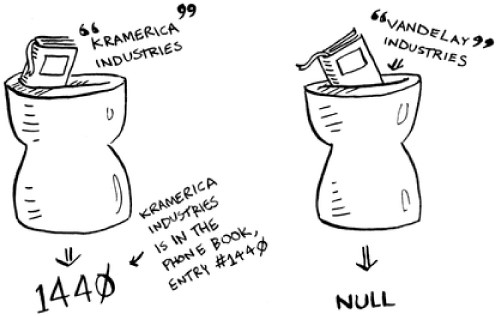

به دنبال شرکت هایی در دفترچه تلفن با جستجوی باینری هستید

در اینجا مثالی از نحوه عملکرد جستجوی باینری آورده شده است. من به عددی بین 1 تا 100 فکر می کنم.

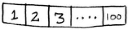

شما باید سعی کنید شماره من را در کمترین تلاش ممکن حدس بزنید. با هر حدس، به شما خواهم گفت که حدس شما خیلی کم، خیلی زیاد یا درست است.
فرض کنید شروع به حدس زدن به این صورت کردید: 1، 2، 3، 4 .... در اینجا چگونه پیش خواهد رفت.

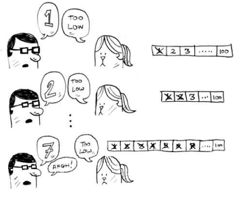

**رویکرد بد برای حدس زدن اعداد**

این جستجوی ساده است (شاید جستجوی احمقانه اصطلاح بهتری باشد). با هر حدس، فقط یک عدد را حذف می کنید. اگر شماره من 99 بود، 99 حدس زدن طول می کشد تا به آنجا برسید!

---

### روشی بهتر برای جستجو

تکنیک بهتری هم وجود دارد. با 50 شروع کنید.

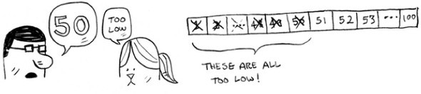

خیلی کم است، اما شما نیمی از اعداد را حذف کردید! اکنون می دانید که اعداد 1 تا 50 بسیار کم هستند. حدس بعدی: 75.


خیلی بالاست، اما دوباره نصف اعداد باقیمانده را کاهش دادید! با جستجوی باینتری، شما عدد وسط را حدس می زنید و هر بار نیمی از اعداد باقی مانده را حذف می کنید. بعدی 63 است (نیمه راه بین 50 تا 75).


این جستجو باینری است. شما به تازگی اولین الگوریتم خود را یاد گرفتید! در اینجا آمده است که هر بار چند عدد را می توانید حذف کنید.

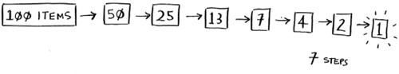

**هر بار با جستجوی باینری نیمی از اعداد را حذف کنید.**

به هر عددی که فکر می کنم، می توانید حداکثر با هفت مرحله آن را حدس بزنید - زیرا با هر حدس زدن تعداد زیادی اعداد را حذف می کنید!
فرض کنید به دنبال کلمه ای در فرهنگ لغت هستید. فرهنگ لغت دارای 240000 کلمه است. در بدترین حالت، فکر می کنید هر جستجو چند مرحله را طی می کند؟

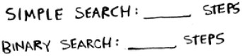

اگر کلمه مورد نظر شما آخرین کلمه در کتاب باشد، جستجوی ساده می‌تواند 240000 مرحله انجام دهد. با هر مرحله از جستجوی باینری، تعداد کلمات را به نصف کاهش می دهید تا زمانی که تنها یک کلمه باقی بماند.

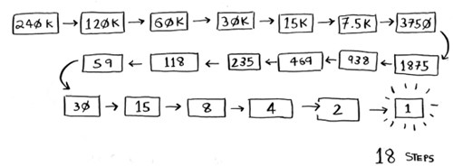

بنابراین جستجوی باینری 18 مرحله خواهد داشت - یک تفاوت بزرگ! به طور کلی، برای هر لیستی از n، جستجوی باینری در بدترین حالت log~2~n مرحله انجام می دهد، در حالی که جستجوی ساده n مرحله را انجام می دهد.

>## لگاریتم
> ممکن است به خاطر نداشته باشید که لگاریتم چیست، اما احتمالاً می دانید که نمایی چیست. log~10~ 100 مانند این است که بپرسیم "چند 10 را با هم ضرب کنیم تا به 100 برسیم؟" پاسخ 2 است: 10 × 10. بنابراین log~10~ 100 = 2. لاگ ها تلنگر نمایی هستند. </br>
> 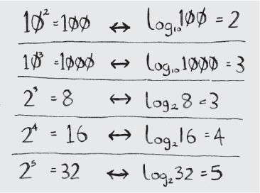
>**لوگاریتم ها ها تلنگر نمایی هستند.**</br>
>در این کتاب، وقتی در مورد زمان اجرا با نماد Big O صحبت می کنم (کمی بعد توضیح داده شد)، log همیشه به معنای log2 است. وقتی یک عنصر را با استفاده از جستجوی ساده جستجو می کنید، در بدترین حالت ممکن است مجبور شوید به تک تک عناصر نگاه کنید. بنابراین برای یک لیست 8 عددی، حداکثر باید 8 عدد را بررسی کنید. برای جستجوی باینری، در بدترین حالت باید log~n~ عنصر را بررسی کنید. برای یک لیست از 8 عنصر، log 8 == 3، زیرا 2^3^ == 8. بنابراین برای یک لیست از 8 عدد، شما باید حداکثر 3 عدد را بررسی کنید. برای لیستی از 1024 عنصر، log 1024 = 10، زیرا 2^10^ == 1024. بنابراین برای لیستی از 1024 عدد، حداکثر باید 10 عدد را بررسی کنید.</br>

>#### توجه داشته باشید
> من در این کتاب در مورد زمان ثبت اطلاعات زیاد صحبت خواهم کرد، بنابراین شما باید مفهوم لگاریتم را درک کنید. اگر ندارید، آکادمی خان (khanacademy.org) یک ویدیوی خوب دارد که آن را روشن می کند.

>#### توجه داشته باشید
> جستجوی باینری تنها زمانی کار می کند که فهرست شما به ترتیب مرتب شده باشد. به عنوان مثال، نام‌های دفترچه تلفن به ترتیب حروف الفبا مرتب شده‌اند، بنابراین می‌توانید از جستجوی دودویی برای جستجوی نام استفاده کنید. اگر نام ها مرتب نمی شدند چه اتفاقی می افتاد؟

بیایید نحوه نوشتن جستجوی باینری در پایتون را ببینیم. نمونه کد در اینجا از آرایه ها استفاده می کند. اگر نمی دانید آرایه ها چگونه کار می کنند، نگران نباشید. آنها در فصل بعدی پوشش داده شده اند. فقط باید بدانید که می توانید دنباله ای از عناصر را در ردیفی از سطل های متوالی به نام آرایه ذخیره کنید. سطل ها با 0 شروع می شوند: سطل اول در موقعیت #0، سطل دوم #1، سطل سوم #2 و غیره است.

تابع «جستجوی_دودویی» یک آرایه مرتب شده و یک آیتم می گیرد. اگر مورد در آرایه باشد، تابع موقعیت خود را برمی‌گرداند. شما ردیابی خواهید کرد که چه بخشی از آرایه را باید جستجو کنید. در ابتدا، این کل آرایه است:

```python
low = 0
high = len(list) - 1
```

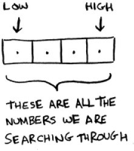

هر بار، عنصر میانی را بررسی می کنید:

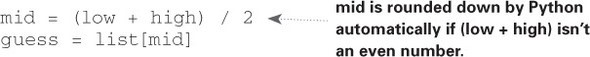

اگر حدس خیلی کم است، بر این اساس کم را به روز می کنید:

```python
if
    guess < item:
    low = mid + 1
```

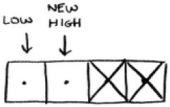

و اگر حدس خیلی زیاد باشد، بالا را به روز می کنید. این کد کامل است:

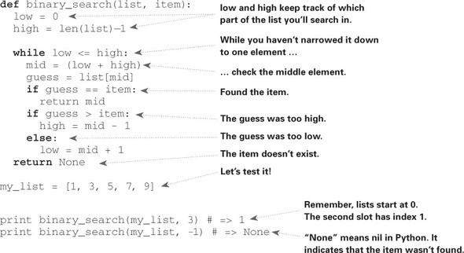


## تمرین

### 1.1
فرض کنید یک لیست مرتب شده از 128 نام دارید و با استفاده از جستجوی باینری در حال جستجو در آن هستید. حداکثر تعداد مراحلی که انجام می شود چقدر است؟


### 1.2
فرض کنید اندازه لیست را دو برابر کرده اید. در حال حاضر حداکثر تعداد مراحل چقدر است؟


## زمان اجرا

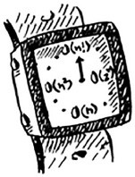

هر زمان که در مورد یک الگوریتم صحبت می کنم، در مورد زمان اجرای آن صحبت خواهم کرد. به طور کلی شما می خواهید کارآمدترین الگوریتم را انتخاب کنید - چه بخواهید برای زمان یا مکان بهینه سازی کنید.

بازگشت به جستجوی باینری با استفاده از آن چقدر در زمان صرفه جویی می کنید؟ خب، اولین رویکرد این بود که هر عدد را یک به یک بررسی کنیم. اگر این لیستی از 100 عدد باشد، تا 100 حدس نیاز دارد. اگر فهرستی از 4 میلیارد عدد باشد، تا 4 میلیارد حدس نیاز دارد. بنابراین حداکثر تعداد حدس ها به اندازه اندازه لیست است. به این زمان خطی می گویند.
جستجوی باینری متفاوت است. اگر لیست 100 مورد باشد، حداکثر 7 حدس نیاز دارد. اگر لیست 4 میلیارد مورد باشد، حداکثر 32 حدس می‌زند. قدرتمند، نه؟ جستجوی باینری در زمان لگاریتمی (یا زمان ثبت، همانطور که بومیان آن را می‌گویند) اجرا می‌شود. در اینجا جدولی است که یافته های امروز ما را خلاصه می کند.

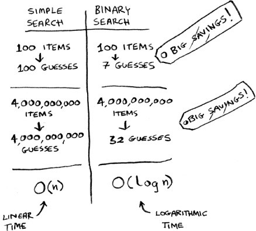

## BIG O NOTATION
نماد Big O یک نماد ویژه است که به شما می گوید سرعت یک الگوریتم چقدر است. چه کسی اهمیت می دهد؟ خوب، معلوم می شود که شما اغلب از الگوریتم های افراد دیگر استفاده خواهید کرد - و وقتی این کار را انجام می دهید، درک سرعت یا کندی آنها خوب است. در این بخش، نماد Big O چیست و فهرستی از متداول‌ترین زمان‌های اجرای الگوریتم‌هایی که از آن استفاده می‌کنند را به شما ارائه می‌دهم.

### زمان اجرای الگوریتم با سرعت های متفاوتی رشد می کند


باب در حال نوشتن یک الگوریتم جستجو برای ناسا است. الگوریتم او زمانی که موشکی در شرف فرود بر روی ماه است راه اندازی می شود و به محاسبه محل فرود کمک می کند.

این مثالی است از اینکه چگونه زمان اجرای دو الگوریتم می‌تواند با سرعت‌های مختلف رشد کند. باب در تلاش است بین جستجوی ساده و جستجوی باینری تصمیم بگیرد. الگوریتم باید سریع و صحیح باشد. از یک طرف، جستجوی باینری سریعتر است. و باب تنها 10 ثانیه فرصت دارد تا بفهمد کجا باید فرود بیاید - در غیر این صورت، موشک از مسیر خود خارج خواهد شد. از سوی دیگر، نوشتن جستجوی ساده آسان‌تر است و احتمال بروز اشکالات کمتری وجود دارد. و باب واقعاً نمی‌خواهد باگ‌هایی در کد برای فرود موشک ایجاد شود! برای دقت بیشتر، باب تصمیم می گیرد هر دو الگوریتم را با لیستی از 100 عنصر زمان بندی کند.

بیایید فرض کنیم برای بررسی یک عنصر 1 میلی ثانیه طول می کشد. با جستجوی ساده، باب باید 100 عنصر را بررسی کند، بنابراین جستجو 100 میلی‌ثانیه طول می‌کشد تا اجرا شود. از طرف دیگر، او فقط باید 7 عنصر را با جستجوی باینری بررسی کند (log2 100 تقریباً 7 است)، بنابراین جستجو 7 میلی‌ثانیه طول می‌کشد تا اجرا شود. اما به طور واقع بینانه، این لیست بیش از یک میلیارد عنصر خواهد داشت. اگر اینطور باشد، جستجوی ساده چقدر طول می کشد؟ جستجوی باینری چقدر طول می کشد؟ قبل از خواندن ادامه، مطمئن شوید که برای هر سوال پاسخی دارید.


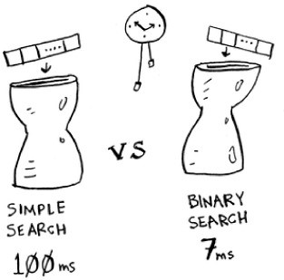

**زمان اجرا برای جستجوی ساده در مقابل جستجوی باینری، با لیستی از 100 عنصر **

Bob جستجوی باینری را با 1 میلیارد عنصر اجرا می کند و 30 میلی ثانیه طول می کشد (log2 1,000,000,000 تقریباً 30 است). "32 میلی ثانیه!" او فکر می کند. جستجوی دودویی حدود 15 برابر سریعتر از جستجوی ساده است، زیرا جستجوی ساده 100 میلی‌ثانیه با 100 عنصر و جستجوی باینری 7 میلی‌ثانیه طول کشید. بنابراین جستجوی ساده 30 × 15 = 450 میلی‌ثانیه طول می‌کشد، درست است؟ خیلی زیر آستانه 10 ثانیه ای من.» باب تصمیم می گیرد با یک جستجوی ساده به آن ادامه دهد. آیا این انتخاب درستی است؟

نه. معلوم شد، باب اشتباه می کند. اشتباه مرده زمان اجرای جستجوی ساده با 1 میلیارد آیتم 1 میلیارد میلی ثانیه خواهد بود که 11 روز است! مشکل این است که زمان اجرا برای جستجوی باینری و جستجوی ساده با سرعت یکسانی رشد نمی کند.

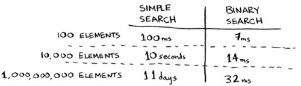

یعنی با افزایش تعداد آیتم ها، جستجوی باینری کمی زمان بیشتری برای اجرا می برد. اما جستجوی ساده زمان بیشتری را برای اجرا نیاز دارد. بنابراین با بزرگتر شدن لیست اعداد، جستجوی باینری ناگهان بسیار سریعتر از جستجوی ساده می شود. باب فکر می کرد جستجوی دودویی 15 برابر سریعتر از جستجوی ساده است، اما این درست نیست. اگر فهرست دارای 1 میلیارد آیتم باشد، 33 میلیون بار سریع‌تر است. به همین دلیل است که دانستن مدت زمان اجرای یک الگوریتم کافی نیست - باید بدانید با افزایش اندازه لیست، زمان اجرا چگونه افزایش می‌یابد. اینجاست که نماد Big O وارد می شود.

نماد O بزرگ به شما می گوید که یک الگوریتم چقدر سریع است. برای مثال، فرض کنید فهرستی با اندازه n دارید. جستجوی ساده باید هر عنصر را بررسی کند، بنابراین n عملیات طول خواهد کشید. زمان اجرا در نماد Big O O(n) است. ثانیه ها کجا هستند؟ هیچ کدام وجود ندارد - Big O سرعت را در چند ثانیه به شما نمی گوید. نماد O بزرگ به شما امکان می دهد تعداد عملیات را مقایسه کنید. به شما می گوید که الگوریتم با چه سرعتی رشد می کند.


در اینجا یک مثال دیگر است. جستجوی باینری برای بررسی لیستی از اندازه n به عملیات log n نیاز دارد. زمان اجرا در نماد Big O چقدر است؟ O (log n) است. به طور کلی نماد Big O به صورت زیر نوشته می شود.

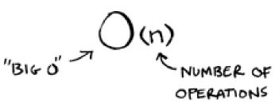

** نماد Big O چگونه به نظر می رسد **


این تعداد عملیاتی که یک الگوریتم انجام می دهد را به شما می گوید. این نماد Big O نامیده می شود زیرا شما یک "O بزرگ" را در جلوی تعداد عملیات قرار می دهید (به نظر شوخی می رسد، اما درست است!).

اکنون به چند نمونه نگاه می کنیم. ببینید آیا می توانید زمان اجرای این الگوریتم ها را مشخص کنید.


#### تجسم زمان های مختلف اجرای Big O

در اینجا یک مثال عملی است که می توانید در خانه با چند تکه کاغذ و یک مداد دنبال کنید. فرض کنید باید یک شبکه از 16 جعبه بکشید.

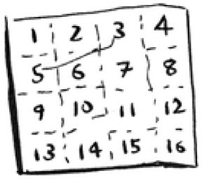

**الگوریتم خوبی برای ترسیم این شبکه چیست؟**

#### الگوریتم 1

یکی از راه‌های انجام این کار، کشیدن 16 جعبه، یکی یکی است. به یاد داشته باشید که نماد Big O تعداد عملیات را می شمارد. در این مثال، رسم یک جعبه یک عملیات است. شما باید 16 جعبه بکشید. کشیدن یک جعبه در هر بار چند عملیات طول می کشد؟


کشیدن یک شبکه یک جعبه در یک زمان

کشیدن 16 جعبه 16 مرحله طول می کشد. زمان اجرای این الگوریتم چقدر است؟

#### الگوریتم 2

در عوض این الگوریتم را امتحان کنید. کاغذ را تا کنید.


در این مثال، یک بار تا کردن کاغذ یک عملیات است. شما فقط با این عملیات دو جعبه درست کردید!

کاغذ را دوباره و دوباره و دوباره تا کنید.


بعد از چهار تا زدن آن را باز کنید و یک شبکه زیبا خواهید داشت! هر تا زدن تعداد جعبه ها را دو برابر می کند. شما با 4 عملیات 16 جعبه ساختید!

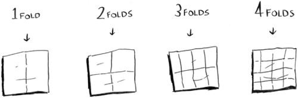

**کشیدن یک شبکه در چهار تا**

شما می توانید با هر تا زدن دو برابر تعداد کادرها را بکشید، بنابراین می توانید 16 جعبه را در 4 مرحله بکشید. زمان اجرای این الگوریتم چقدر است؟ قبل از حرکت، زمان‌های اجرای هر دو الگوریتم را مشخص کنید.
پاسخ ها: الگوریتم 1 زمان O(n) و الگوریتم 2 O(log n) زمان می برد.

### Big O یک زمان اجرا در بدترین حالت ایجاد می کند

فرض کنید از جستجوی ساده برای جستجوی شخصی در دفترچه تلفن استفاده می کنید. می‌دانید که جستجوی ساده به زمان O(n) برای اجرا نیاز دارد، به این معنی که در بدترین حالت، باید تک تک ورودی‌های دفترچه تلفن خود را بررسی کنید. در این مورد، شما به دنبال Adit هستید. این مرد اولین ورودی در دفترچه تلفن شما است. بنابراین لازم نبود به هر ورودی نگاه کنید - در اولین تلاش آن را پیدا کردید. آیا این الگوریتم زمان O(n) را صرف کرده است؟ یا به دلیل اینکه در اولین تلاش فرد مورد نظر را پیدا کردید، زمان O(1) طول کشید؟

جستجوی ساده همچنان به زمان O(n) نیاز دارد. در این صورت، فوراً چیزی را که به دنبالش بودید پیدا کردید. این بهترین سناریو است. اما نماد Big O در مورد بدترین سناریو است. بنابراین می توانید بگویید که در بدترین حالت، باید هر ورودی دفترچه تلفن را یک بار نگاه کنید. زمان O(n) است. این یک اطمینان است - می دانید که جستجوی ساده هرگز کندتر از زمان O(n) نخواهد بود.

>### توجه
> همراه با بدترین زمان اجرا، توجه به زمان اجرای متوسط ​​نیز مهم است. بدترین حالت در مقابل حالت متوسط ​​در فصل 4 مورد بحث قرار گرفته است.

### برخی از زمان های رایج اجرای Big O

در اینجا پنج زمان اجرای Big O وجود دارد که با آن‌ها زیاد مواجه خواهید شد، که از سریع‌ترین به کندترین مرتب‌سازی شده‌اند:

- O(log n)، همچنین به عنوان زمان ورود شناخته می شود. مثال: جستجوی باینری
- O(n)، همچنین به عنوان زمان خطی شناخته می شود. مثال: جستجوی ساده
- O(n * log n). مثال: یک الگوریتم مرتب‌سازی سریع، مانند مرتب‌سازی سریع (که در فصل 4 آمده است).
- O(n2). مثال: یک الگوریتم مرتب‌سازی آهسته، مانند مرتب‌سازی انتخابی (در فصل 2 آمده است).
- بر!). مثال: یک الگوریتم بسیار کند، مانند فروشنده دوره گرد (آینده بعدی!).

فرض کنید دوباره یک شبکه از 16 کادر ترسیم می کنید و می توانید از بین 5 الگوریتم مختلف برای این کار انتخاب کنید. اگر از الگوریتم اول استفاده کنید، برای ترسیم شبکه زمان O(log n) طول می کشد. شما می توانید 10 عملیات در ثانیه انجام دهید. با زمان O(log n)، 4 عمل طول می کشد تا شبکه ای از 16 کادر را بکشید (log 16 برابر 4 است). بنابراین 0.4 ثانیه طول می کشد تا شبکه را بکشید. اگر بخواهید 1024 جعبه بکشید چه؟ برای رسم شبکه ای از 1024 کادر، 1024 = 10 عملیات یا 1 ثانیه طول می کشد. این اعداد از الگوریتم اول استفاده می کنند.

الگوریتم دوم کندتر است: زمان O(n) طول می کشد. برای رسم 16 جعبه 16 عملیات و برای رسم 1024 جعبه به 1024 عملیات نیاز است. چقدر زمان در ثانیه است؟

در اینجا آمده است که ترسیم یک شبکه برای بقیه الگوریتم‌ها، از سریع‌ترین به کندترین، چقدر طول می‌کشد:

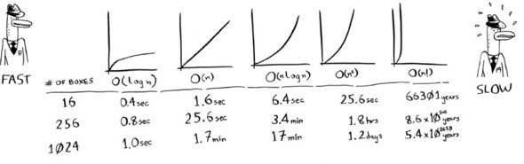

**زمان های اجرا دیگری نیز وجود دارد، اما این پنج مورد رایج ترین هستند.**

این یک ساده سازی است. در واقع شما نمی‌توانید زمان اجرای Big O را به این ترتیب به تعدادی عملیات تبدیل کنید، اما در حال حاضر به اندازه کافی خوب است. پس از اینکه چند الگوریتم دیگر را یاد گرفتید، در فصل 4 به نماد Big O باز خواهیم گشت. در حال حاضر، موارد اصلی به شرح زیر است:

-سرعت الگوریتم بر حسب ثانیه نیست، بلکه با رشد تعداد عملیات اندازه گیری می شود.
-درعوض، ما در مورد سرعت افزایش زمان اجرای یک الگوریتم با افزایش اندازه ورودی صحبت می کنیم.
-زمان اجرای الگوریتم ها با نماد Big O بیان می شود.
-O(log n) سریعتر از O(n) است، اما با افزایش فهرست مواردی که جستجو می کنید، سرعت آن بسیار بیشتر می شود.


## تمرینات
زمان اجرا را برای هر یک از این سناریوها بر حسب Big O مشخص کنید.


1.3
شما یک نام دارید و می خواهید شماره تلفن آن شخص را در دفترچه تلفن پیدا کنید.


1.4
شما یک شماره تلفن دارید و می خواهید نام شخص را در دفترچه تلفن پیدا کنید. (نکته: شما باید کل کتاب را جستجو کنید!)


1.5
شما می خواهید شماره هر فرد را در دفترچه تلفن بخوانید.


1.6
شما می خواهید اعداد As را بخوانید. (این یک مشکل است! شامل مفاهیمی است که بیشتر در فصل 4 پوشش داده شده است. پاسخ را بخوانید—شاید تعجب کنید!)

### فروشنده دوره گرد


ممکن است آن بخش آخر را خوانده باشید و فکر کرده باشید، "هیچ راهی وجود ندارد که من با الگوریتمی مواجه شوم که O(n!) زمان می برد." خوب، اجازه دهید سعی کنم به شما ثابت کنم که اشتباه می کنید! در اینجا نمونه ای از یک الگوریتم با زمان اجرای بسیار بد است. این یک مشکل معروف در علم کامپیوتر است، زیرا رشد آن وحشتناک است و برخی از افراد بسیار باهوش فکر می کنند که نمی توان آن را بهبود بخشید. به آن مشکل فروشنده دوره گرد می گویند.


**شما یک فروشنده دارید.**
فروشنده باید به پنج شهر برود.

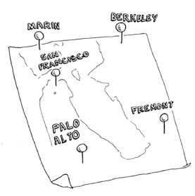

این فروشنده، که من اوپوس را صدا می کنم، می خواهد هر پنج شهر را در حالی که حداقل مسافت را طی می کند، بزند. در اینجا یک راه برای انجام این کار وجود دارد: به هر ترتیب ممکنی که او می تواند به شهرها سفر کند نگاه کنید.

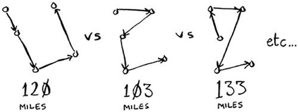

او کل مسافت را جمع می کند و سپس مسیری را که کمترین فاصله را دارد انتخاب می کند. 120 جایگشت با 5 شهر وجود دارد، بنابراین برای حل مشکل 5 شهر به 120 عملیات نیاز است. برای 6 شهر، 720 عملیات انجام می شود (720 جایگشت وجود دارد). برای 7 شهر، 5040 عملیات طول می کشد!

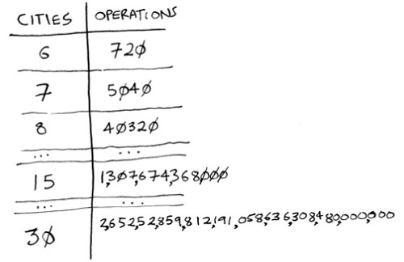

**تعداد عملیات به شدت افزایش می یابد.**

به طور کلی، برای n مورد، n طول می کشد! (n فاکتوریل) عملیات برای محاسبه نتیجه. بنابراین این زمان O(n!) یا زمان فاکتوریل است. برای همه چیز به جز کوچکترین اعداد، عملیات زیادی لازم است. هنگامی که با بیش از 100 شهر سر و کار دارید، محاسبه پاسخ به موقع غیرممکن است - ابتدا خورشید فرو می ریزد.
این یک الگوریتم وحشتناک است! Opus باید از یکی دیگر استفاده کند، درست است؟ اما او نمی تواند. این یکی از مشکلات حل نشده در علوم کامپیوتر است. هیچ الگوریتم سریع شناخته شده ای برای آن وجود ندارد و افراد باهوش فکر می کنند که داشتن یک الگوریتم هوشمند برای این مشکل غیرممکن است. بهترین کاری که می توانیم انجام دهیم این است که یک راه حل تقریبی ارائه دهیم. برای اطلاعات بیشتر به فصل 10 مراجعه کنید.
یک نکته پایانی: اگر خواننده پیشرفته ای هستید، درختان جستجوی دودویی را بررسی کنید! شرح مختصری از آنها در فصل آخر وجود دارد.

## خلاصه

- جستجوی باینری بسیار سریعتر از جستجوی ساده است.
- O(log n) سریعتر از O(n) است، اما زمانی که لیست مواردی که در آن جستجو می کنید بزرگ شود، بسیار سریعتر می شود.
- سرعت الگوریتم در ثانیه اندازه گیری نمی شود.
- زمان های الگوریتم بر حسب رشد یک الگوریتم اندازه گیری می شود.
- زمان های الگوریتم با نماد O بزرگ نوشته شده است.


</div>


[^1]: binary search
[^2]: Big O notation
[^3]: graph algorithms 
[^4]: k-Nearest Neighbors
[^5]: NP-complete 