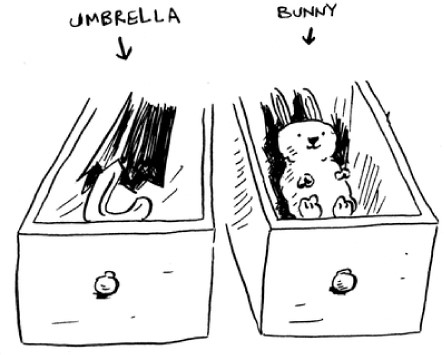
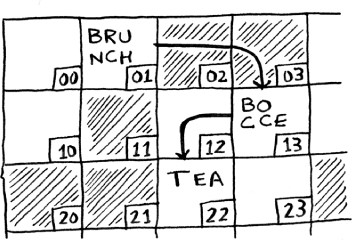
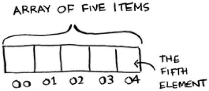

In this chapter

- You learn about arrays and linked lists—two of the most basic data structures. They’re used absolutely everywhere. You already used arrays in chapter 1, and you’ll use them in almost every chapter in this book. Arrays are a crucial topic, so pay attention! But sometimes it’s better to use a linked list instead of an array. This chapter explains the pros and cons of both so you can decide which one is right for your algorithm. 
- You learn your first sorting algorithm. A lot of algorithms only work if your data is sorted. Remember binary search? You can run binary search only on a sorted list of elements. This chapter teaches you selection sort. Most languages have a sorting algorithm built in, so you’ll rarely need to write your own version from scratch. But selection sort is a stepping stone to quicksort, which I’ll cover in the next chapter. Quicksort is an important algorithm, and it will be easier to understand if you know one sorting algorithm already. 

>What you need to know 
>To understand the performance analysis bits in this chapter, you need to know Big O notation and logarithms. If you don’t know those, I suggest you go back and read chapter 1. Big O notation will be used throughout the rest of the book. 

HOW MEMORY WORKS 

Imagine you go to a show and need to check your things. A chest of drawers is available.

Each drawer can hold one element. You want to store two things, so you ask for two drawers.

You store your two things here.

And you’re ready for the show! This is basically how your computer’s memory works. Your computer looks like a giant set of drawers, and each drawer has an address. 

fe Øffeeb is the address of a slot in memory.
Each time you want to store an item in memory, you ask the computer for some space, and it gives you an address where you can store your item. If you want to store multiple items, there are two basic ways to do so: arrays and lists. I’ll talk about arrays and lists next, as well as the pros and cons of each. There isn’t one right way to store items for every use case, so it’s important to know the differences.

### ARRAYS AND LINKED LISTS 

Sometimes you need to store a list of elements in memory. Suppose you’re writing an app to manage your todos. You’ll want to store the todos as a list in memory. 

Should you use an array, or a linked list? Let’s store the todos in an array first, because it’s easier to grasp. Using an array means all your tasks are stored contiguously (right next to each other) in memory. 

Now suppose you want to add a fourth task. But the next drawer is taken up by someone else’s stuff!

It’s like going to a movie with your friends and finding a place to sit—but another friend joins you, and there’s no place for them. You have to move to a new spot where you all fit. In this case, you need to ask your computer for a different chunk of memory that can fit four tasks. Then you need to move all your tasks there. 

If another friend comes by, you’re out of room again—and you all have to move a second time! What a pain. Similarly, adding new items to an array can be a big pain. If you’re out of space and need to move to a new spot in memory every time, adding a new item will be really slow. One easy fix is to “hold seats”: even if you have only 3 items in your task list, you can ask the computer for 10 slots, just in case. Then you can add 10 items to your task list without having to move. This is a good workaround, but you should be aware of a couple of downsides: 

- You may not need the extra slots that you asked for, and then that memory will be wasted. You aren’t using it, but no one else can use it either. 
- You may add more than 10 items to your task list and have to move anyway. 

So it’s a good workaround, but it’s not a perfect solution. Linked lists solve this problem of adding items.

### Linked lists 

With linked lists, your items can be anywhere in memory.

Each item stores the address of the next item in the list. A bunch of random memory addresses are linked together.

**Linked memory addresses**

It’s like a treasure hunt. You go to the first address, and it says, “The next item can be found at address 123.” So you go to address 123, and it says, “The next item can be found at address 847,” and so on. Adding an item to a linked list is easy: you stick it anywhere in memory and store the address with the previous item. 

With linked lists, you never have to move your items. You also avoid another problem. Let’s say you go to a popular movie with five of your friends. The six of you are trying to find a place to sit, but the theater is packed. There aren’t six seats together. Well, sometimes this happens with arrays. Let’s say you’re trying to find 10,000 slots for an array. Your memory has 10,000 slots, but it doesn’t have 10,000 slots together. You can’t get space for your array! A linked list is like saying, “Let’s split up and watch the movie.” If there’s space in memory, you have space for your linked list. 
If linked lists are so much better at inserts, what are arrays good for?

### Arrays 

Websites with top-10 lists use a scummy tactic to get more page views. Instead of showing you the list on one page, they put one item on each page and make you click Next to get to the next item in the list. For example, Top 10 Best TV Villains won’t show you the entire list on one page. Instead, you start at #10 (Newman), and you have to click Next on each page to reach #1 (Gustavo Fring). This technique gives the websites 10 whole pages on which to show you ads, but it’s boring to click Next 9 times to get to #1. It would be much better if the whole list was on one page and you could click each person’s name for more info. 

Linked lists have a similar problem. Suppose you want to read the last item in a linked list. You can’t just read it, because you don’t know what address it’s at. Instead, you have to go to item #1 to get the address for item #2. Then you have to go to item #2 to get the address for item #3. And so on, until you get to the last item. Linked lists are great if you’re going to read all the items one at a time: you can read one item, follow the address to the next item, and so on. But if you’re going to keep jumping around, linked lists are terrible. 

Arrays are different. You know the address for every item in your array. For example, suppose your array contains five items, and you know it starts at address 00. What is the address of item #5? 

Simple math tells you: it’s 04. Arrays are great if you want to read random elements, because you can look up any element in your array instantly. With a linked list, the elements aren’t next to each other, so you can’t instantly calculate the position of the fifth element in memory—you have to go to the first element to get the address to the second element, then go to the second element to get the address of the third element, and so on until you get to the fifth element. 

### Terminology 

The elements in an array are numbered. This numbering starts from 0, not 1. For example, in this array, 20 is at position 1. 
