In this chapter

- You learn about arrays and linked lists—two of the most basic data structures. They’re used absolutely everywhere. You already used arrays in chapter 1, and you’ll use them in almost every chapter in this book. Arrays are a crucial topic, so pay attention! But sometimes it’s better to use a linked list instead of an array. This chapter explains the pros and cons of both so you can decide which one is right for your algorithm. 
- You learn your first sorting algorithm. A lot of algorithms only work if your data is sorted. Remember binary search? You can run binary search only on a sorted list of elements. This chapter teaches you selection sort. Most languages have a sorting algorithm built in, so you’ll rarely need to write your own version from scratch. But selection sort is a stepping stone to quicksort, which I’ll cover in the next chapter. Quicksort is an important algorithm, and it will be easier to understand if you know one sorting algorithm already. 

>What you need to know 
>To understand the performance analysis bits in this chapter, you need to know Big O notation and logarithms. If you don’t know those, I suggest you go back and read chapter 1. Big O notation will be used throughout the rest of the book. 

HOW MEMORY WORKS 

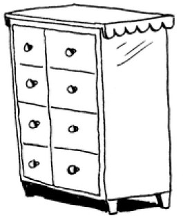

Imagine you go to a show and need to check your things. A chest of drawers is available.

Each drawer can hold one element. You want to store two things, so you ask for two drawers.

You store your two things here.

And you’re ready for the show! This is basically how your computer’s memory works. Your computer looks like a giant set of drawers, and each drawer has an address. 

fe Øffeeb is the address of a slot in memory.
Each time you want to store an item in memory, you ask the computer for some space, and it gives you an address where you can store your item. If you want to store multiple items, there are two basic ways to do so: arrays and lists. I’ll talk about arrays and lists next, as well as the pros and cons of each. There isn’t one right way to store items for every use case, so it’s important to know the differences.

### ARRAYS AND LINKED LISTS 

Sometimes you need to store a list of elements in memory. Suppose you’re writing an app to manage your todos. You’ll want to store the todos as a list in memory. 

Should you use an array, or a linked list? Let’s store the todos in an array first, because it’s easier to grasp. Using an array means all your tasks are stored contiguously (right next to each other) in memory. 

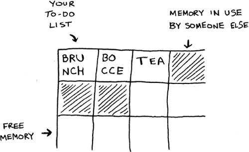

Now suppose you want to add a fourth task. But the next drawer is taken up by someone else’s stuff!

It’s like going to a movie with your friends and finding a place to sit—but another friend joins you, and there’s no place for them. You have to move to a new spot where you all fit. In this case, you need to ask your computer for a different chunk of memory that can fit four tasks. Then you need to move all your tasks there. 

If another friend comes by, you’re out of room again—and you all have to move a second time! What a pain. Similarly, adding new items to an array can be a big pain. If you’re out of space and need to move to a new spot in memory every time, adding a new item will be really slow. One easy fix is to “hold seats”: even if you have only 3 items in your task list, you can ask the computer for 10 slots, just in case. Then you can add 10 items to your task list without having to move. This is a good workaround, but you should be aware of a couple of downsides: 

- You may not need the extra slots that you asked for, and then that memory will be wasted. You aren’t using it, but no one else can use it either. 
- You may add more than 10 items to your task list and have to move anyway. 

So it’s a good workaround, but it’s not a perfect solution. Linked lists solve this problem of adding items.

### Linked lists 

With linked lists, your items can be anywhere in memory.

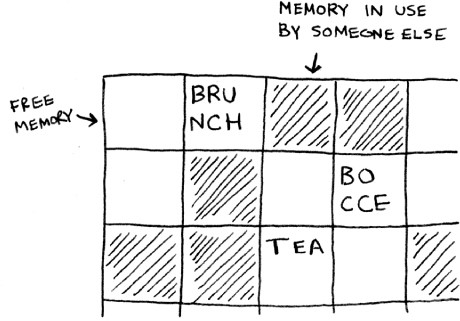

Each item stores the address of the next item in the list. A bunch of random memory addresses are linked together.

**Linked memory addresses**

It’s like a treasure hunt. You go to the first address, and it says, “The next item can be found at address 123.” So you go to address 123, and it says, “The next item can be found at address 847,” and so on. Adding an item to a linked list is easy: you stick it anywhere in memory and store the address with the previous item. 

With linked lists, you never have to move your items. You also avoid another problem. Let’s say you go to a popular movie with five of your friends. The six of you are trying to find a place to sit, but the theater is packed. There aren’t six seats together. Well, sometimes this happens with arrays. Let’s say you’re trying to find 10,000 slots for an array. Your memory has 10,000 slots, but it doesn’t have 10,000 slots together. You can’t get space for your array! A linked list is like saying, “Let’s split up and watch the movie.” If there’s space in memory, you have space for your linked list. 
If linked lists are so much better at inserts, what are arrays good for?

### Arrays 

Websites with top-10 lists use a scummy tactic to get more page views. Instead of showing you the list on one page, they put one item on each page and make you click Next to get to the next item in the list. For example, Top 10 Best TV Villains won’t show you the entire list on one page. Instead, you start at #10 (Newman), and you have to click Next on each page to reach #1 (Gustavo Fring). This technique gives the websites 10 whole pages on which to show you ads, but it’s boring to click Next 9 times to get to #1. It would be much better if the whole list was on one page and you could click each person’s name for more info. 

Linked lists have a similar problem. Suppose you want to read the last item in a linked list. You can’t just read it, because you don’t know what address it’s at. Instead, you have to go to item #1 to get the address for item #2. Then you have to go to item #2 to get the address for item #3. And so on, until you get to the last item. Linked lists are great if you’re going to read all the items one at a time: you can read one item, follow the address to the next item, and so on. But if you’re going to keep jumping around, linked lists are terrible. 

Arrays are different. You know the address for every item in your array. For example, suppose your array contains five items, and you know it starts at address 00. What is the address of item #5? 

Simple math tells you: it’s 04. Arrays are great if you want to read random elements, because you can look up any element in your array instantly. With a linked list, the elements aren’t next to each other, so you can’t instantly calculate the position of the fifth element in memory—you have to go to the first element to get the address to the second element, then go to the second element to get the address of the third element, and so on until you get to the fifth element. 

### Terminology 

The elements in an array are numbered. This numbering starts from 0, not 1. For example, in this array, 20 is at position 1. 

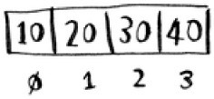

And 10 is at position 0. This usually throws new programmers for a spin. Starting at 0 makes all kinds of array-based code easier to write, so programmers have stuck with it. Almost every programming language you use will number array elements starting at 0. You’ll soon get used to it. 
The position of an element is called its index. So instead of saying, “20 is at position 1,” the correct terminology is, “20 is at index 1.” I’ll use index to mean position throughout this book. 
Here are the run times for common operations on arrays and lists.

Question: Why does it take O(n) time to insert an element into an array? Suppose you wanted to insert an element at the beginning of an array. How would you do it? How long would it take? Find the answers to these questions in the next section! 

## Exercise 

2.1 
Suppose you’re building an app to keep track of your finances.

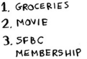

Every day, you write down everything you spent money on. At the end of the month, you review your expenses and sum up how much you spent. So, you have lots of inserts and a few reads. Should you use an array or a list? 

## Inserting into the middle of a list 

Suppose you want your todo list to work more like a calendar. Earlier, you were adding things to the end of the list.
Now you want to add them in the order in which they should be done.

What’s better if you want to insert elements in the middle: arrays or lists? With lists, it’s as easy as changing what the previous element points to. 

But for arrays, you have to shift all the rest of the elements down.

And if there’s no space, you might have to copy everything to a new location! Lists are better if you want to insert elements into the middle. 

## Deletions 

What if you want to delete an element? Again, lists are better, because you just need to change what the previous element points to. With arrays, everything needs to be moved up when you delete an element. 
Unlike insertions, deletions will always work. Insertions can fail sometimes when there’s no space left in memory. But you can always delete an element. 
Here are the run times for common operations on arrays and linked lists.

t’s worth mentioning that insertions and deletions are O(1) time only if you can instantly access the element to be deleted. It’s a common practice to keep track of the first and last items in a linked list, so it would take only O(1) time to delete those. 
Which are used more: arrays or lists? Obviously, it depends on the use case. But arrays see a lot of use because they allow random access. There are two different types of access: random access and sequential access. Sequential access means reading the elements one by one, starting at the first element. Linked lists can only do sequential access. If you want to read the 10th element of a linked list, you have to read the first 9 elements and follow the links to the 10th element. Random access means you can jump directly to the 10th element. You’ll frequently hear me say that arrays are faster at reads. This is because they provide random access. A lot of use cases require random access, so arrays are used a lot. Arrays and lists are used to implement other data structures, too (coming up later in the book). 

## Exercises 

2.2 
Suppose you’re building an app for restaurants to take customer orders. Your app needs to store a list of orders. Servers keep adding orders to this list, and chefs take orders off the list and make them. It’s an order queue: servers add orders to the back of the queue, and the chef takes the first order off the queue and cooks it. 

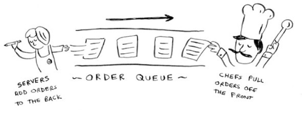

Would you use an array or a linked list to implement this queue? (Hint: Linked lists are good for inserts/deletes, and arrays are good for random access. Which one are you going to be doing here?) 

2.3 
Let’s run a thought experiment. Suppose Facebook keeps a list of usernames. When someone tries to log in to Facebook, a search is done for their username. If their name is in the list of usernames, they can log in. People log in to Facebook pretty often, so there are a lot of searches through this list of usernames. Suppose Facebook uses binary search to search the list. Binary search needs random access—you need to be able to get to the middle of the list of usernames instantly. Knowing this, would you implement the list as an array or a linked list? 

2.4 
People sign up for Facebook pretty often, too. Suppose you decided to use an array to store the list of users. What are the downsides of an array for inserts? In particular, suppose you’re using binary search to search for logins. What happens when you add new users to an array? 

2.5 
In reality, Facebook uses neither an array nor a linked list to store user information. Let’s consider a hybrid data structure: an array of linked lists. You have an array with 26 slots. Each slot points to a linked list. For example, the first slot in the array points to a linked list containing all the usernames starting with a. The second slot points to a linked list containing all the usernames starting with b, and so on. 

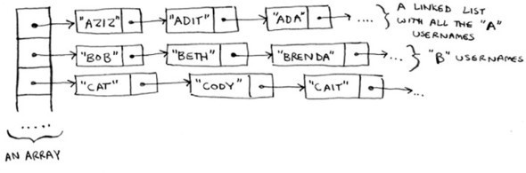

Suppose Adit B signs up for Facebook, and you want to add them to the list. You go to slot 1 in the array, go to the linked list for slot 1, and add Adit B at the end. Now, suppose you want to search for Zakhir H. You go to slot 26, which points to a linked list of all the Z names. Then you search through that list to find Zakhir H. 
Compare this hybrid data structure to arrays and linked lists. Is it slower or faster than each for searching and inserting? You don’t have to give Big O run times, just whether the new data structure would be faster or slower. 

## Selection sort 

Let’s put it all together to learn your second algorithm: selection sort. To follow this section, you need to understand arrays and lists, as well as Big O notation. 

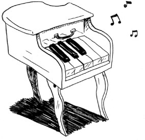

Suppose you have a bunch of music on your computer. For each artist, you have a play count.

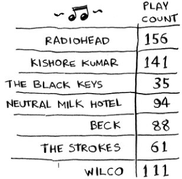

You want to sort this list from most to least played, so that you can rank your favorite artists. How can you do it?
One way is to go through the list and find the most-played artist. Add that artist to a new list.

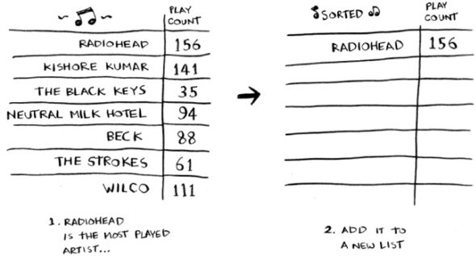

Do it again to find the next-most-played artist.

Keep doing this, and you’ll end up with a sorted list.

Let’s put on our computer science hats and see how long this will take to run. Remember that O(n) time means you touch every element in a list once. For example, running simple search over the list of artists means looking at each artist once. 

To find the artist with the highest play count, you have to check each item in the list. This takes O(n) time, as you just saw. So you have an operation that takes O(n) time, and you have to do that n times: 

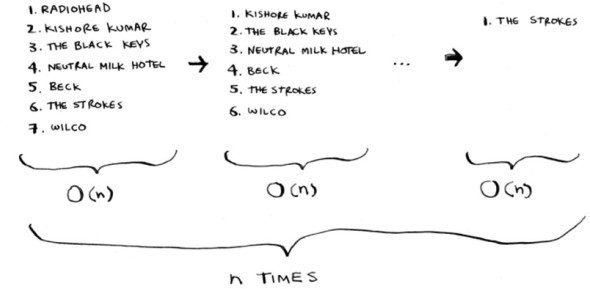

This takes O(n × n) time or O(n2) time. 
Sorting algorithms are very useful. Now you can sort

- Names in a phone book 
- Travel dates 
- Emails (newest to oldest) 

>Checking fewer elements each time 
>Maybe you’re wondering: as you go through the operations, the number of elements you have to check keeps decreasing. Eventually, you’re down to having to check just one element. So how can the run time still be O(n2)? That’s a good question, and the answer has to do with constants in Big O notation. I’ll get into this more in chapter 4, but here’s the gist. 
>You’re right that you don’t have to check a list of n elements each time. You check n elements, then n – 1, n - 2 ... 2, 1. On average, you check a list that has ½ n elements. The runtime is O(n × ½ n). But constants like ½ are ignored in Big O notation (again, see chapter 4 for the full discussion), so you just write O(n × n) or O(n2). 

Selection sort is a neat algorithm, but it’s not very fast. Quicksort is a faster sorting algorithm that only takes O(n log n) time. It’s coming up in the next chapter! 

## Example Code Listing 

We didn’t show you the code to sort the music list, but following is some code that will do something very similar: sort an array from smallest to largest. Let’s write a function to find the smallest element in an array: 

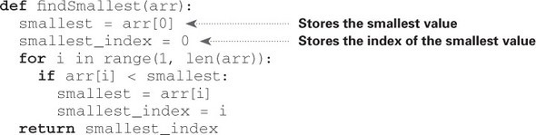

Now you can use this function to write selection sort:

## Recap 

- Your computer’s memory is like a giant set of drawers. 
- When you want to store multiple elements, use an array or a list. 
- With an array, all your elements are stored right next to each other. 
- With a list, elements are strewn all over, and one element stores the address of the next one. 
- Arrays allow fast reads. 
- Linked lists allow fast inserts and deletes. 
- All elements in the array should be the same type (all ints, all doubles, and so on). 