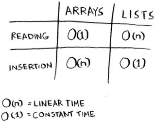
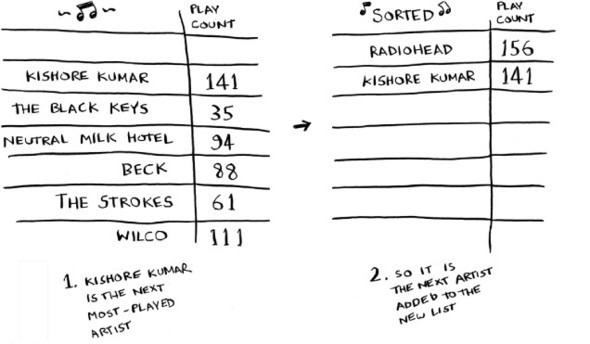

# مرتب سازی انتخابی

در این فصل

- در مورد آرایه ها و لیست های پیوندی - دو تا از اساسی ترین ساختارهای داده - یاد می گیرید. آنها کاملاً در همه جا استفاده می شوند. شما قبلاً از آرایه‌ها در فصل 1 استفاده کرده‌اید، و تقریباً در هر فصل این کتاب از آنها استفاده خواهید کرد. آرایه ها موضوع مهمی هستند، پس توجه کنید! اما گاهی اوقات بهتر است به جای آرایه از یک لیست پیوندی استفاده کنید. این فصل مزایا و معایب هر دو را توضیح می دهد تا بتوانید تصمیم بگیرید کدام یک برای الگوریتم شما مناسب است.
- اولین الگوریتم مرتب سازی خود را یاد می گیرید. بسیاری از الگوریتم ها تنها در صورتی کار می کنند که داده های شما مرتب شده باشند. جستجوی باینری را به خاطر دارید؟ شما می توانید جستجوی باینری را فقط در لیست مرتب شده ای از عناصر اجرا کنید. این فصل مرتب سازی انتخابی را به شما آموزش می دهد. اکثر زبان ها دارای یک الگوریتم مرتب سازی هستند، بنابراین به ندرت نیاز خواهید داشت که نسخه خود را از ابتدا بنویسید. اما مرتب سازی انتخابی پله ای برای مرتب سازی سریع است که در فصل بعدی به آن خواهم پرداخت. مرتب‌سازی سریع یک الگوریتم مهم است و اگر از قبل یک الگوریتم مرتب‌سازی را بشناسید، درک آن آسان‌تر خواهد بود.

> آنچه شما باید بدانید
> برای درک قسمت های تحلیل عملکرد در این فصل، باید نماد O بزرگ و لگاریتم ها را بدانید. اگر آن‌ها را نمی‌دانید، پیشنهاد می‌کنم برگردید و فصل 1 را بخوانید. نماد O بزرگ در بقیه کتاب استفاده خواهد شد.

## حافظه چگونه کار می کند

تصور کنید به یک نمایش می روید و باید وسایل خود را بررسی کنید. یک عدد کشو موجود است.

هر کشو می تواند یک عنصر را در خود جای دهد. شما می خواهید دو چیز را ذخیره کنید، بنابراین دو کشو می خواهید.

شما دو چیز خود را اینجا ذخیره می کنید.

و شما برای نمایش آماده هستید! اساساً حافظه رایانه شما اینگونه کار می کند. کامپیوتر شما شبیه یک مجموعه بزرگ از کشوها است و هر کشو یک آدرس دارد.

fe Øffeeb آدرس یک قسمت در حافظه است.
هر بار که می خواهید یک مورد را در حافظه ذخیره کنید، از رایانه کمی فضا در خواست میکنید و او آدرسی به شما می دهد که می توانید آیتم های خود را در آنجا ذخیره کنید. اگر می خواهید چندین آیتم را ذخیره کنید، دو راه اساسی برای این کار وجود دارد: آرایه ها و لیست ها. در ادامه در مورد آرایه ها و لیست ها و همچنین مزایا و معایب هر کدام صحبت خواهم کرد. یک راه درست برای ذخیره اقلام برای هر مورد استفاده وجود ندارد، بنابراین مهم است که تفاوت ها را بدانید.

### آرایه ها و لیست های پیوندی (arrays andlinked lists)

گاهی اوقات لازم است فهرستی از عناصر را در حافظه ذخیره کنید. فرض کنید در حال نوشتن یک برنامه برای مدیریت کارهای خود هستید. شما می خواهید کارها را به عنوان یک لیست در حافظه ذخیره کنید.

آیا باید از یک آرایه یا یک لیست پیوندی استفاده کنید؟ بیایید ابتدا کارها را در یک آرایه ذخیره کنیم، زیرا درک آن آسان تر است. استفاده از آرایه به این معنی است که تمام وظایف شما به طور پیوسته (در کنار یکدیگر) در حافظه ذخیره می شوند.

حالا فرض کنید می خواهید یک کار چهارم اضافه کنید. اما کشوی بعدی را وسایل شخص دیگری اشغال می کند!

مثل این است که با دوستان خود به یک فیلم بروید و جایی برای نشستن پیدا کنید - اما دوست دیگری به شما می پیوندد و جایی برای او نیست. شما باید به مکان جدیدی بروید که به اندازه همه جا باشد. در این مورد، باید از رایانه خود یک حافظه متفاوت بخواهید که بتواند چهار کار را در خود جای دهد. سپس باید تمام وظایف خود را به آنجا منتقل کنید.

اگر دوست دیگری آمد، شما دوباره از اتاق خارج می شوید - و همه باید برای بار دوم حرکت کنید! چه دردی. به طور مشابه، افزودن آیتم های جدید به یک آرایه می تواند دردسر بزرگی باشد. اگر فضای خالی ندارید و هر بار نیاز دارید که به یک نقطه جدید در حافظه بروید، افزودن یک آیتم جدید واقعا کند خواهد بود. یک راه حل آسان این است که «صندلی ها را نگه دارید»: حتی اگر فقط 3 مورد در لیست وظایف خود دارید، می توانید از رایانه 10 اسلات بخواهید، فقط در صورت امکان. سپس می توانید 10 مورد را بدون نیاز به جابجایی به لیست وظایف خود اضافه کنید. این یک راه حل خوب است، اما باید از چند جنبه منفی آگاه باشید:

- ممکن است به اسلات های اضافی که خواسته اید نیاز نداشته باشید و سپس آن حافظه هدر می رود. شما از آن استفاده نمی کنید، اما هیچ کس دیگری نیز نمی تواند از آن استفاده کند.
- می توانید بیش از 10 مورد را به لیست وظایف خود اضافه کنید و به هر حال مجبور به حرکت شوید.

بنابراین راه حل خوبی است، اما راه حل کاملی نیست. لیست های پیوندی این مشکل اضافه کردن موارد را حل می کند.

## لیست های پیوندی

با لیست‌های پیوندی، آیتم های شما می‌توانند در هر جایی از حافظه باشند.

هر مورد آدرس مورد بعدی را در لیست ذخیره می کند. دسته ای از آدرس های حافظه های تصادفی به هم مرتبط شده اند.

**آدرس حافظه پیوندی**

این مانند یک گنج یابی است. شما به آدرس اول می روید، و می گوید: "مورد بعدی را می توان در آدرس 123 پیدا کرد." بنابراین به آدرس 123 می روید و می گوید: "مورد بعدی را می توان در آدرس 847 پیدا کرد" و ... . افزودن یک مورد به یک لیست پیوندی آسان است: آن را در هر جایی در حافظه می چسبانید و آدرس را با مورد قبلی ذخیره می کنید.

با لیست های پیوندی، هرگز مجبور نیستید موارد خود را جابجا کنید. همچنین از مشکل دیگری جلوگیری می کنید. فرض کنید با پنج نفر از دوستانتان به یک فیلم محبوب می روید. شما شش نفری سعی می کنید جایی برای نشستن پیدا کنید، اما تئاتر مملو از جمعیت است. شش صندلی با هم نیست. خوب، گاهی اوقات این اتفاق با آرایه ها می افتد. فرض کنید در حال تلاش برای یافتن 10000 اسلات برای یک آرایه هستید. حافظه شما 10000 اسلات دارد، اما 10000 اسلات با هم ندارد. شما نمی توانید فضایی برای آرایه خود داشته باشید! یک لیست پیوندی مانند این است که بگویید: "بیایید از هم جدا شویم و فیلم را تماشا کنیم." اگر فضایی در حافظه وجود دارد، فضایی برای لیست پیوندی خود دارید.
اگر لیست های پیوندی در درج بسیار بهتر هستند، آرایه ها برای چه چیزی خوب هستند؟

### آرایه ها

وب سایت هایی که دارای 10 لیست برتر هستند، از یک تاکتیک زمخت برای بازدید بیشتر از صفحه استفاده می کنند. به جای اینکه لیست را در یک صفحه به شما نشان دهند، یک مورد را در هر صفحه قرار می دهند و شما را مجبور می کنند روی Next کلیک کنید تا به مورد بعدی در لیست برسید. به عنوان مثال، 10 بهترین شرور تلویزیونی کل لیست را در یک صفحه به شما نشان نمی دهند. در عوض، از شماره 10 (نیومن) شروع می‌کنید و باید در هر صفحه روی Next کلیک کنید تا به شماره 1 (گوستاوو فرینگ) برسید. این تکنیک به وب‌سایت‌ها 10 صفحه کامل می‌دهد تا تبلیغات را به شما نشان دهند، اما خسته‌کننده است که 9 بار روی Next کلیک کنید تا به شماره 1 برسید. اگر کل لیست در یک صفحه باشد و بتوانید برای اطلاعات بیشتر روی نام هر فرد کلیک کنید، بسیار بهتر است.

لیست های پیوندی نیز مشکل مشابهی دارند. فرض کنید می خواهید آخرین مورد را در یک لیست پیوندی بخوانید. شما نمی توانید آن را فقط بخوانید، زیرا نمی دانید در چه آدرسی است. در عوض، برای دریافت آدرس مورد شماره ۲، باید به آیتم شماره ۱ بروید. سپس برای دریافت آدرس مورد شماره 3 باید به آیتم شماره 2 بروید. و به همین ترتیب، تا زمانی که به آخرین مورد برسید. اگر می‌خواهید همه موارد را در یک زمان بخوانید، لیست‌های پیوندی عالی هستند: می‌توانید یک مورد را بخوانید، آدرس مورد بعدی را دنبال کنید و غیره. اما اگر می خواهید به دور و بر خود بپرید، لیست های پیوندی وحشتناک هستند.

آرایه ها متفاوت هستند. شما آدرس هر مورد در آرایه خود را می دانید. به عنوان مثال، فرض کنید آرایه شما شامل پنج آیتم است و می دانید که از آدرس 00 شروع می شود. آدرس آیتم شماره 5 چیست؟

ریاضیات ساده به شما می‌گوید: 04 است. اگر می‌خواهید عناصر تصادفی را بخوانید، آرایه‌ها عالی هستند، زیرا می‌توانید فوراً هر عنصری را در آرایه خود جستجو کنید. با یک لیست پیوندی، عناصر در کنار یکدیگر نیستند، بنابراین نمی‌توانید فوراً موقعیت پنجمین عنصر را در حافظه محاسبه کنید - باید به اولین عنصر بروید تا آدرس عنصر دوم را دریافت کنید، سپس بروید. به عنصر دوم برای دریافت آدرس عنصر سوم و همینطور ادامه دهید تا به عنصر پنجم برسید.

### واژه شناسی

عناصر موجود در یک آرایه شماره گذاری شده اند. این شماره گذاری از 0 شروع می شود نه از 1. برای مثال در این آرایه 20 در موقعیت 1 قرار دارد.

و 10 در موقعیت 0 است. این معمولاً برنامه نویسان جدید را گیج میکند. شروع از 0، نوشتن انواع کدهای مبتنی بر آرایه را آسان تر می کند، بنابراین برنامه نویسان به آن پایبند هستند. تقریباً هر زبان برنامه‌نویسی که استفاده می‌کنید، عناصر آرایه‌ای را که از 0 شروع می‌شوند شماره‌گذاری می‌کنند. به زودی به آن عادت خواهید کرد.
موقعیت یک عنصر را ایندکس آن می نامند. بنابراین به جای گفتن «۲۰ در جایگاه ۱ است»، اصطلاح درست این است که «۲۰ در ایندکس ۱ است». من از ایندکس به معنای موقعیت در سراسر این کتاب استفاده خواهم کرد.
در اینجا زمان اجرای عملیات رایج در آرایه ها و لیست ها آمده است.

سوال: چرا زمان O(n) برای وارد کردن یک عنصر در یک آرایه طول می کشد؟ فرض کنید می خواهید عنصری را در ابتدای یک آرایه وارد کنید. چگونه آن را انجام می دهید؟ چه مدت طول می کشد؟ پاسخ این سوالات را در بخش بعدی بیابید!

## تمرین

2.1
فرض کنید در حال ساخت اپلیکیشنی برای پیگیری وضعیت مالی خود هستید.

هر روز هر چیزی را که هزینه کرده اید یادداشت می کنید. در پایان ماه، هزینه‌های خود را بررسی می‌کنید و میزان هزینه‌های خود را جمع‌بندی می‌کنید. بنابراین، شما تعداد زیادی درج و تعداد کمی خواندن دارید. باید از آرایه استفاده کنید یا لیست؟

## درج در وسط یک لیست

فرض کنید می‌خواهید فهرست کارهایتان بیشتر شبیه یک تقویم باشد. قبلاً چیزهایی را به انتهای لیست اضافه می کردید.
اکنون می خواهید آنها را به ترتیبی که باید انجام شوند اضافه کنید.

اگر بخواهید عناصر را در وسط وارد کنید، چه چیزی بهتر است: آرایه ها یا لیست ها؟ با فهرست‌ها، تغییر آنچه عنصر قبلی به آن اشاره می‌کند آسان است.

اما برای آرایه‌ها، باید بقیه عناصر را به پایین حرکت دهید.

و اگر فضایی وجود ندارد، ممکن است مجبور شوید همه چیز را در یک مکان جدید کپی کنید! اگر می‌خواهید عناصر را در وسط قرار دهید، فهرست‌ها بهتر هستند.

## حذف

اگر بخواهید یک عنصر را حذف کنید چه؟ باز هم، لیست ها بهتر هستند، زیرا فقط باید آنچه را که عنصر قبلی به آن اشاره می کند تغییر دهید. با آرایه ها، وقتی یک عنصر را حذف می کنید، همه چیز باید به بالا منتقل شود.
برخلاف درج‌ها، حذف‌ها همیشه کار می‌کنند. درج‌ها ممکن است گاهی اوقات زمانی که فضایی در حافظه باقی نمی‌ماند با شکست مواجه شوند. اما همیشه می توانید یک عنصر را حذف کنید.
در اینجا زمان اجرا برای عملیات رایج در آرایه ها و لیست های پیوندی آمده است.

شایان ذکر است که درج‌ها و حذف‌ها فقط زمانی O(1) هستند که بتوانید فوراً به عنصری که باید حذف شود دسترسی پیدا کنید. پیگیری اولین و آخرین موارد در یک لیست پیوندی یک روش معمول است، بنابراین حذف آن‌ها فقط O(1) زمان می‌برد.
کدام بیشتر استفاده می شود: آرایه ها یا لیست ها؟ بدیهی است که بستگی به مورد استفاده دارد. اما آرایه ها کاربرد زیادی دارند زیرا امکان دسترسی تصادفی را فراهم می کنند. دو نوع مختلف دسترسی وجود دارد: دسترسی تصادفی و دسترسی متوالی. دسترسی متوالی به معنای خواندن یک به یک عناصر، با شروع از عنصر اول است. لیست های پیوندی فقط می توانند دسترسی متوالی را انجام دهند. اگر می خواهید دهمین عنصر یک لیست پیوندی را بخوانید، باید 9 عنصر اول را بخوانید و پیوندهای عنصر دهم را دنبال کنید. دسترسی تصادفی به این معنی است که می توانید مستقیماً به عنصر دهم بپرید. اغلب می شنوید که می گویم آرایه ها در خواندن سریعتر هستند. این به این دلیل است که آنها دسترسی تصادفی را فراهم می کنند. بسیاری از موارد استفاده نیاز به دسترسی تصادفی دارند، بنابراین آرایه ها بسیار مورد استفاده قرار می گیرند. آرایه‌ها و فهرست‌ها برای پیاده‌سازی سایر ساختارهای داده نیز استفاده می‌شوند (در ادامه کتاب آمده است).

## تمرینات

2.2
فرض کنید در حال ساخت اپلیکیشنی برای رستوران ها هستید تا سفارشات مشتری را دریافت کنید. برنامه شما باید فهرستی از سفارشات را ذخیره کند. سرورها مرتباً سفارش‌ها را به این لیست اضافه می‌کنند و سرآشپزها سفارش‌ها را از لیست خارج می‌کنند و آنها را تهیه می‌کنند. این یک صف سفارش است: سرورها سفارش ها را به پشت صف اضافه می کنند و سرآشپز اولین سفارش را از صف خارج می کند و آن را می پزد.

آیا از یک آرایه یا یک لیست پیوندی برای پیاده سازی این صف استفاده می کنید؟ (نکته: لیست‌های پیوندی برای درج/حذف و آرایه‌ها برای دسترسی تصادفی مناسب هستند. کدام یک را در اینجا انجام می‌دهید؟)

2.3
بیایید یک آزمایش فکری انجام دهیم. فرض کنید فیس بوک لیستی از نام های کاربری را نگه می دارد. هنگامی که شخصی سعی می کند به فیس بوک وارد شود، نام کاربری او جستجو می شود. اگر نام آن‌ها در لیست نام‌های کاربری باشد، می‌توانند وارد شوند. مردم اغلب به فیس‌بوک وارد می‌شوند، بنابراین جستجوهای زیادی از طریق این لیست از نام‌های کاربری انجام می‌شود. فرض کنید فیس بوک از جستجوی باینری برای جستجوی لیست استفاده می کند. جستجوی باینری نیاز به دسترسی تصادفی دارد—شما باید بتوانید فوراً به وسط لیست نام های کاربری برسید. با دانستن این موضوع، آیا لیست را به عنوان یک آرایه یا یک لیست پیوندی پیاده سازی می کنید؟

2.4
مردم نیز اغلب در فیس بوک ثبت نام می کنند. فرض کنید تصمیم گرفتید از یک آرایه برای ذخیره لیست کاربران استفاده کنید. نکات منفی یک آرایه برای درج چیست؟ به طور خاص، فرض کنید از جستجوی باینری برای جستجوی لاگین ها استفاده می کنید. وقتی کاربران جدیدی به آرایه اضافه می کنید چه اتفاقی می افتد؟

2.5
در واقعیت، فیس بوک از آرایه و لیست پیوندی برای ذخیره اطلاعات کاربر استفاده نمی کند. بیایید یک ساختار داده ترکیبی را در نظر بگیریم: آرایه ای از لیست های مرتبط. شما یک آرایه با 26 اسلات دارید. هر اسلات به یک لیست پیوندی اشاره می کند. به عنوان مثال، اولین اسلات در آرایه به یک لیست پیوندی اشاره می کند که شامل همه نام های کاربری است که با a شروع می شود. اسلات دوم به یک لیست پیوندی شامل همه نام‌های کاربری که با b شروع می‌شوند و غیره اشاره می‌کند.

فرض کنید Adit B در فیس بوک ثبت نام کرده و می خواهید آنها را به لیست اضافه کنید. شما به اسلات 1 در آرایه می روید، به لیست پیوند شده برای اسلات 1 رفته و Adit B را در پایان اضافه می کنید. حالا، فرض کنید می‌خواهید Zakhir H را جستجو کنید. به اسلات 26 می‌روید، که به لیست پیوندی از همه نام‌های Z اشاره می‌کند. سپس در آن لیست جستجو می کنید تا زاخیر اچ را پیدا کنید.
این ساختار داده ترکیبی را با آرایه ها و لیست های پیوندی مقایسه کنید. آیا برای جستجو و درج از هر کدام کندتر است یا سریعتر؟ شما مجبور نیستید زمان اجرای Big O را تعیین کنید، فقط اینکه ساختار داده جدید سریعتر یا کندتر باشد.

بیایید همه را کنار هم بگذاریم تا الگوریتم دوم خود را یاد بگیریم: انتخاب مرتب سازی. برای دنبال کردن این بخش، باید آرایه ها و لیست ها و همچنین نماد Big O را بدانید.

فرض کنید یک دسته موسیقی روی رایانه خود دارید. برای هر هنرمند،شما یک تعداد پخش دارید.

شما می خواهید این لیست را از بیشترین به کمترین پخش شده مرتب کنید تا بتوانید هنرمندان مورد علاقه خود را رتبه بندی کنید. چگونه می توانید آن را انجام دهید؟
یکی از راه‌ها این است که فهرست را مرور کنید و هنرمندی را که بیشترین پخش را داشته است، پیدا کنید. آن هنرمند را به یک لیست جدید اضافه کنید.

دوباره این کار را انجام دهید تا هنرمند بعدی را که بیشترین پلی را داشته پیدا کنید.

این کار را ادامه دهید و در نهایت با یک لیست مرتب شده مواجه خواهید شد.

بیایید کلاه های علوم کامپیوتر خود را بر سر بگذاریم و ببینیم این کار چقدر طول می کشد. به یاد داشته باشید که زمان O(n) به این معنی است که شما هر عنصر یک لیست را یک بار چک می کنید. به عنوان مثال، جستجوی ساده روی لیست هنرمندان به معنای یک بار نگاه کردن به هر هنرمند است.

برای پیدا کردن هنرمندی که بیشترین تعداد پخش را دارد، باید هر مورد را در لیست بررسی کنید. همانطور که قبلاً دیدید این زمان O(n) طول می کشد. بنابراین شما عملیاتی دارید که O(n) زمان می برد و باید آن را n بار انجام دهید:

این زمان O(n × n) یا زمان O(n2) طول می کشد.
الگوریتم های مرتب سازی بسیار مفید هستند. حالا می توانید مرتب کنید

- نام ها در دفترچه تلفن
- تاریخ سفر
- ایمیل ها (جدیدترین تا قدیمی ترین)

> هر بار عناصر کمتری را بررسی کنید
> شاید تعجب کنید: با انجام عملیات، تعداد عناصری که باید بررسی کنید همچنان کاهش می یابد. در نهایت، مجبورید فقط یک عنصر را بررسی کنید. بنابراین چگونه می‌توان زمان اجرا همچنان O(n^2^) باشد؟ این سوال خوبی است و پاسخ آن مربوط به ثابت‌های نماد Big O است. در فصل 4 بیشتر به این موضوع خواهم پرداخت، اما اصل ماجرا اینجاست.
> حق با شماست که لازم نیست هر بار لیستی از n عنصر را بررسی کنید. شما n عنصر را بررسی می کنید، سپس n – 1، n - 2 ... 2، 1 را بررسی می کنید. به طور متوسط، لیستی را بررسی می کنید که دارای ½ n عنصر باشد. زمان اجرا O(n × ½ n) است. اما ثابت هایی مانند ½ در نماد Big O نادیده گرفته می شوند (دوباره برای بحث کامل به فصل 4 مراجعه کنید)، بنابراین فقط O(n × n) یا O(n2) را بنویسید.

مرتب سازی انتخاب یک الگوریتم منظم است، اما خیلی سریع نیست. Quicksort یک الگوریتم مرتب‌سازی سریع‌تر است که فقط O(n log n) زمان می‌برد. در فصل بعدی مطرح می شود!

## فهرست کد مثال

ما کدی را برای مرتب‌سازی فهرست موسیقی به شما نشان ندادیم، اما کدی در زیر آمده است که کاری بسیار مشابه را انجام می‌دهد: مرتب‌سازی یک آرایه از کوچک‌ترین به بزرگ‌ترین. بیایید تابعی بنویسیم تا کوچکترین عنصر یک آرایه را پیدا کنیم:

اکنون می توانید از این تابع برای نوشتن مرتب سازی انتخاب استفاده کنید:

## خلاصه

- حافظه رایانه شما مانند یک مجموعه بزرگ از کشوها است.
- هنگامی که می خواهید چندین عنصر را ذخیره کنید، از یک آرایه یا یک لیست استفاده کنید.
- با یک آرایه، تمام عناصر شما دقیقاً در کنار یکدیگر ذخیره می شوند.
- با یک لیست، عناصر در همه جا پراکنده می شوند و یک عنصر آدرس عنصر بعدی را ذخیره می کند.
- آرایه ها اجازه خواندن سریع را می دهند.
- لیست های پیوندی اجازه درج و حذف سریع را می دهند.
- تمام عناصر موجود در آرایه باید از یک نوع باشند (همه اعداد صحیح باشند، همه اعداد اعشاری باشند و غیره).

