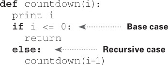

<div dir="rtl">

# بازگشت

## در این فصل

- شما در مورد "بازگشت" یاد می گیرید. "بازگشت" یک تکنیک کدگذاری است که در بسیاری از الگوریتم ها استفاده می شود. این یک بلوک ساختمانی برای درک فصل های بعدی این کتاب است.
- یاد می گیرید که چگونه یک مسئله را به یک حالت پایه و یک مورد بازگشتی تقسیم کنید. استراتژی تقسیم و حل (فصل 4) از این مفهوم ساده برای حل مسائل سخت استفاده می کند.

من در مورد این فصل هیجان زده هستم زیرا بازگشت را پوشش می دهد، روشی زیبا برای حل مشکلات. بازگشت یکی از موضوعات مورد علاقه من است، اما تفرقه انگیز است. مردم یا آن را دوست دارند یا از آن متنفرند، یا از آن متنفرند تا اینکه چند سال بعد یاد بگیرند که آن را دوست داشته باشند. من شخصاً در آن اردوگاه سوم بودم. برای اینکه کار را برای شما راحت تر کنم، توصیه هایی دارم:

- این فصل دارای نمونه های کد زیادی است. کد را برای خودتان اجرا کنید تا ببینید چگونه کار می کند.
- در مورد توابع بازگشتی صحبت خواهم کرد. حداقل یک بار، از یک تابع بازگشتی با قلم و کاغذ عبور کنید: چیزی مانند، «ببینیم، من 5 را به فاکتوریل منتقل می کنم، و سپس 5 بار با عبور از 4 به فاکتوریل، که ... است، برمی گردم، و غیره. قدم زدن در یک تابع مانند این به شما یاد می دهد که یک تابع بازگشتی چگونه کار می کند.

این فصل همچنین شامل بسیاری از شبه کدها است. کد کاذب یک توضیح سطح بالا از مشکلی است که در تلاش برای حل آن در کد هستید. مانند کد نوشته شده است، اما قرار است به گفتار انسان نزدیکتر باشد.

## بازگشت

فرض کنید در اتاق زیر شیروانی مادربزرگتان حفاری می کنید و با یک چمدان قفل شده مرموز روبرو می شوید.


مادربزرگ به شما می گوید که احتمالاً کلید چمدان در این جعبه دیگر است.


این جعبه حاوی جعبه های بیشتری است، با جعبه های بیشتری در داخل آن جعبه ها. کلید در جعبه ای در جایی است. الگوریتم شما برای جستجوی کلید چیست؟ قبل از ادامه مطلب به الگوریتمی فکر کنید.
در اینجا یک رویکرد وجود دارد.


1. انبوهی از جعبه ها را بسازید تا از بین آنها نگاه کنید.
2. یک جعبه را بردارید و از طریق آن نگاه کنید.
3. اگر جعبه ای پیدا کردید، آن را به انبوه اضافه کنید تا بعداً آن را بررسی کنید.
4. اگر کلیدی پیدا کردید، کارتان تمام است!
5. تکرار کنید.

در اینجا یک رویکرد جایگزین وجود دارد.


1. از طریق جعبه نگاه کنید.
2. اگر جعبه ای پیدا کردید، به مرحله 1 بروید.
3. اگر کلیدی پیدا کردید، کارتان تمام است!

کدام رویکرد برای شما راحت تر به نظر می رسد؟ روش اول از یک حلقه while استفاده می کند. در حالی که توده خالی نیست، جعبه ای را بردارید و از میان آن نگاه کنید:

<div dir="ltr">

```python
def look_for_key(main_box):
    pile = main_box.make_a_pile_to_look_through()
    while pile is not empty:
        box = pile.grab_a_box()    
        for item in box:      
            if item.is_a_box():
                pile.append(item)
      
            elif item.is_a_key():
                print "found the key!"

```

</div>

راه دوم از بازگشت استفاده می کند. بازگشت جایی است که یک تابع خود را فراخوانی می کند. در اینجا راه دوم در شبه کد است:


هر دو رویکرد یک چیز را انجام می دهند، اما رویکرد دوم برای من واضح تر است. بازگشت زمانی استفاده می شود که راه حل را واضح تر می کند. هیچ مزیت عملکردی برای استفاده از بازگشت وجود ندارد. در واقع، حلقه ها گاهی اوقات برای عملکرد بهتر هستند. من این نقل قول توسط لی کالدول در Stack Overflow را دوست دارم: [«حلقه ها ممکن است به افزایش عملکرد برای برنامه شما دست یابند. بازگشت ممکن است به افزایش عملکرد برای برنامه نویس شما منجر شود. انتخاب کنید کدام یک در موقعیت شما مهمتر است!»](http://stackoverflow.com/a/72694/139117.)

بسیاری از الگوریتم های مهم از بازگشت استفاده می کنند، بنابراین درک مفهوم مهم است.

## مورد پایه و مورد بازگشتی


از آنجا که یک تابع بازگشتی خود را فراخوانی می کند، نوشتن یک تابع به اشتباه که در یک حلقه بی نهایت ختم می شود، آسان است. به عنوان مثال، فرض کنید می خواهید تابعی بنویسید که یک شمارش معکوس چاپ می کند، مانند این:

`>>> 3...2...1`

می توانید آن را به صورت بازگشتی بنویسید، مانند:

<div dir="ltr">

```python
def countdown(i):
    print i
    countdown(i-1)
```

</div>

این کد را بنویسید و اجرا کنید. متوجه مشکلی خواهید شد: این تابع برای همیشه اجرا خواهد شد!


**حلقه بی نهایت**

`>>> 3...2...1...0...-1...-2...`

(Ctrl-C را فشار دهید تا اسکریپت خود را متوقف کنید.)<br>

هنگامی که یک تابع بازگشتی می نویسید، باید به آن بگویید که چه زمانی تکرار را متوقف کند. به همین دلیل است که هر تابع بازگشتی دارای دو بخش است: حالت پایه و حالت بازگشتی. حالت بازگشتی زمانی است که تابع خود را فراخوانی می کند. حالت پایه زمانی است که تابع دوباره خود را فراخوانی نمی کند ... بنابراین به یک حلقه بی نهایت نمی رود.

بیایید یک مورد پایه به تابع شمارش معکوس اضافه کنیم:



اکنون عملکرد همانطور که انتظار می رود کار می کند. چیزی شبیه به این پیش میاد.


## پشته
این بخش فراخوانی پشته را پوشش می دهد. این یک مفهوم مهم در برنامه نویسی است. فراخوانی پشته یک مفهوم مهم در برنامه نویسی عمومی است و درک آن هنگام استفاده از بازگشت نیز مهم است.


فرض کنید دارید یک باربیکیو میپزید. شما یک لیست کار برای باربیکیو، به شکل پشته ای از استیکی نوت نگه می دارید.


زمانی را به خاطر می آورید که در مورد آرایه ها و لیست ها صحبت می کردیم، و شما یک لیست کار داشتید؟ می توانید موارد انجام کار را در هر جایی به لیست اضافه کنید یا موارد تصادفی را حذف کنید. پشته یادداشت های چسبناک بسیار ساده تر است. هنگامی که یک مورد را وارد می کنید، به بالای لیست اضافه می شود. وقتی یک مورد را می خوانید، فقط بالاترین مورد را می خوانید و از لیست حذف می شود. بنابراین لیست کارهای شما فقط دو عمل دارد: فشار (درج) و پاپ (حذف و خواندن).


بیایید لیست کارها را در عمل ببینیم.


به این ساختار داده، پشته می گویند. پشته یک ساختار داده ساده است. شما در تمام این مدت بدون اینکه متوجه شوید از یک پشته استفاده کرده اید!

## فراخوانی پشته

رایانه شما از پشته ای به نام فراخوانی پشتیبانی استفاده می کند. بیایید آن را در عمل ببینیم. در اینجا یک تابع ساده وجود دارد:

<div dir="ltr">

```python
def greet(name):
    print "hello, " + name + "!"
    greet2(name)
    print "getting ready to say bye..."
    bye()
```

</div>

این تابع به شما خوش آمد می گوید و سپس دو تابع دیگر را فراخوانی می کند. در اینجا آن دو تابع وجود دارد:

<div dir="ltr">

```python
def greet2(name):
    print "how are you, " + name + "?"

def bye():
    print "ok bye!"
```

</div>

بیایید به اتفاقاتی که هنگام فراخوانی یک تابع می افتد بپردازیم.

> توجه داشته باشید
> print یک تابع در پایتون است، اما برای آسان‌تر کردن کار برای این مثال، وانمود می‌کنیم که اینطور نیست. فقط با هم بازی کن

فرض کنید greet("maggie") را صدا می زنید. ابتدا، رایانه شما یک جعبه حافظه برای آن فراخوانی تابع اختصاص می دهد.


حالا بیایید از حافظه استفاده کنیم. نام متغیر روی "maggie" تنظیم شده است. که باید در حافظه ذخیره شود.


هر بار که یک تابع فراخوانی می کنید، رایانه شما مقادیر تمام متغیرهای آن فراخوانی را در حافظه ذخیره می کند. بعد، شما چاپ سلام، مگی! سپس با greet2("maggie") فراخوانی میکنید. مجدداً، رایانه شما یک جعبه حافظه برای این فراخوانی تابع اختصاص می دهد.


رایانه شما از یک پشته برای این جعبه ها استفاده می کند. جعبه دوم در بالای جعبه اول اضافه می شود.شما "حالت چطوره مگی؟" را چاپ میکنید سپس از فراخوانی تابع برمی گردید. وقتی این اتفاق می‌افتد، جعبه بالای پشته بیرون می‌آید.


اکنون بالاترین جعبه موجود در پشته مربوط به تابع greet است، به این معنی که شما به تابع greet بازگشته اید. وقتی تابع greet2 را فراخوانی کردید، تابع greet تا حدی تکمیل شد. این ایده بزرگ پشت این بخش است:

هنگامی که تابعی را از تابع دیگری فراخوانی می کنید، تابع فراخوانی در حالت نیمه تکمیل شده متوقف می شود. تمام مقادیر متغیرهای آن تابع هنوز در حافظه ذخیره می شوند. اکنون که کار با عملکرد greet2 تمام شد، به عملکرد greet برگشته اید و از جایی که کار را متوقف کرده اید ادامه می دهید. ابتدا آماده شدن برای خداحافظی را چاپ می کنید .... تابع bye را فراخوانی می کنید.


یک کادر برای آن تابع به بالای پشته اضافه می شود. سپس شما چاپ کنید خداحافظ! و از فراخوانی تابع برگردید.


و به عملکرد خوش آمد گویی بازگشته اید. کار دیگری برای انجام دادن وجود ندارد، بنابراین شما نیز از عملکرد سلام برمی گردید. این پشته که برای ذخیره متغیرها برای چندین تابع استفاده می شود، فراخوانی پشته نامیده می شود.


## تمرین

3.1
فرض کنید من یک پشته تماس مانند این را به شما نشان می دهم.


فقط بر اساس این پشته تماس، چه اطلاعاتی می توانید به من بدهید؟
حالا بیایید پشته تماس را در عمل با یک تابع بازگشتی ببینیم.

## فراخوانی با بازگشت

توابع بازگشتی از فراخوانی پشتیبانی نیز استفاده می کنند! بیایید در عمل با تابع فاکتوریل به این موضوع نگاه کنیم. فاکتوریل(5) به صورت 5 نوشته می شود و به این صورت تعریف می شود: 5! = 5 * 4 * 3 * 2 * 1. به طور مشابه، فاکتوریل(3) 3 * 2 * 1 است. در اینجا یک تابع بازگشتی برای محاسبه فاکتوریل یک عدد وجود دارد:

<div dir="ltr">

```python
def fact(x):
    if x == 1:
        return 1
    else:
        return x * fact(x-1)
```

</div>

حالا شما fact(3) را می نامید. بیایید خط به خط این تماس را طی کنیم و ببینیم که چگونه پشته تغییر می کند. به یاد داشته باشید، بالاترین کادر در پشته به شما می گوید که در حال حاضر از چه چیزی استفاده می کنید.


توجه داشته باشید که هر فراخوانی به fact کپی مخصوص به خود از x دارد. شما نمی توانید به کپی تابع دیگری از x دسترسی پیدا کنید.
پشته نقش مهمی در بازگشت بازی می کند. در مثال ابتدایی، دو رویکرد برای یافتن کلید وجود داشت.این هم از راه حل اول


به این ترتیب، انبوهی از جعبه‌ها را برای جستجو ایجاد می‌کنید، بنابراین همیشه می‌دانید که هنوز چه جعبه‌هایی را باید جستجو کنید.


اما در رویکرد بازگشتی، هیچ توده ای وجود ندارد.


اگر انباشته ای وجود نداشته باشد، الگوریتم شما چگونه می داند که هنوز باید از چه جعبه هایی دیدن کنید؟ در اینجا یک مثال است.


در این مرحله، پشته تماس به این شکل است.


"توده ای از جعبه ها" در پشته ذخیره می شود! این مجموعه ای از فراخوانی های تابع نیمه تمام است که هر کدام لیست نیمه کامل خود را از جعبه هایی دارد که باید از بین آنها نگاه کنید. استفاده از پشته راحت است زیرا مجبور نیستید خودتان انبوهی از جعبه‌ها را پیگیری کنید - پشته این کار را برای شما انجام می‌دهد.
استفاده از پشته راحت است، اما هزینه دارد: ذخیره همه آن اطلاعات می‌تواند حافظه زیادی را اشغال کند. هر یک از این فراخوانی‌های تابع مقداری از حافظه را اشغال می‌کند، و وقتی پشته شما خیلی بلند است، به این معنی است که رایانه شما اطلاعات بسیاری از فراخوانی فاکنکشن ها را ذخیره می‌کند. در آن مرحله، شما دو گزینه دارید:

- می توانید کد خود را بازنویسی کنید تا به جای آن از یک حلقه استفاده کنید.
- می توانید از چیزی به نام بازگشت دم استفاده کنید. این یک موضوع بازگشتی پیشرفته است که خارج از محدوده این کتاب است. همچنین فقط توسط برخی از زبان ها پشتیبانی می شود، نه همه.

## تمرین

3.2
فرض کنید به طور تصادفی یک تابع بازگشتی نوشتید که برای همیشه اجرا می شود. همانطور که دیدید، رایانه شما برای هر فراخوانی فانکشن، حافظه را در پشته تخصیص می دهد. وقتی تابع بازگشتی شما برای همیشه اجرا می شود چه اتفاقی برای پشته می افتد؟

## خلاصه


- بازگشت زمانی است که یک تابع خود را فراخوانی می کند.
- هر تابع بازگشتی دو حالت دارد: حالت پایه و حالت بازگشتی.
- یک پشته دو عملیات دارد: پوش و پاپ.
- همه فراخوانی های تابع به فراخوانی پشته می روند.
- فراخوانی پشته می تواند بسیار بزرگ شود که حافظه زیادی را اشغال می کند.

</div>